## mermaid入门

### 一、简介

Generation of diagrams and flowcharts from text in a similar manner as markdown.

网址：[https://mermaidjs.github.io/](https://links.jianshu.com/go?to=https://mermaidjs.github.io/)

https://mermaid.js.org/intro/


## 二、流程图 - 基本语法


### 1、图形


```java
//该语句声明了一个新图形和图形布局的方向。
graph TB
开始 --> 结束
```

方向是：

- TB - 从上到下
- BT - 从下到上
- RL - 从右到左
- LR - 从左到右
- TD - 与TB相同

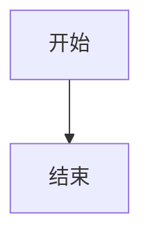


### 2、节点和形状

- （1）节点

> 默认节点就是默认的内容


```java
graph LR
    start
```


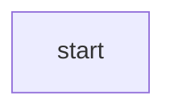

- （2）带有文本的节点

```java
graph LR
    start[开始]
```

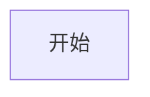


- （3）具有圆边的节点


```java
graph LR
start(开始)
```

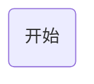


- （4）圆形的节点


```java
graph LR
    start((开始))
```

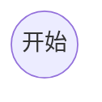

- （5）非对称形状的节点


```java
graph LR
    start>开始]
```

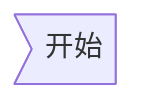


- （6）菱形节点


```java
graph LR
    start{开始}
```

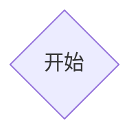


### 3、节点之间的连接

- （1）带箭头的连接


```java
graph LR
  A --> B
```


- （2）没有箭头的连接


```java
graph LR
  A --- B
```

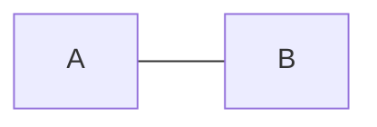

- （3）连接上的文字


```java
graph LR
  A-- 连接上的文字 ---B
```

> 或者


```java
graph LR
    A---|连接上的文字|B
```

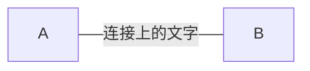

- （4）带箭头和文字的连接


```java
graph LR
    A-->|带箭头和文字的连接|B
```

> 或者


```java
graph LR
    A-- 带箭头和文字的连接 -->B
```

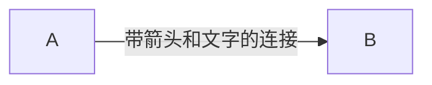

- （5）虚线连接


```java
graph LR
   A-.->B
```

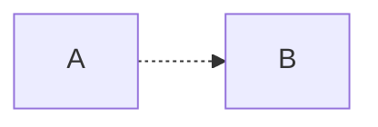


- （6）带文字的虚线连接

```java
graph LR
   A-. 带文字的虚线连接 .-> B
```

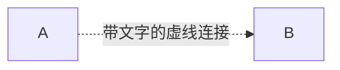


- （7）粗连接

```java
graph LR
   A ==> B
```

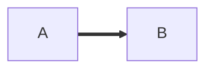

- （8）带文本的粗连接

```java
graph LR
   A == 带文本的粗连接 ==> B
```

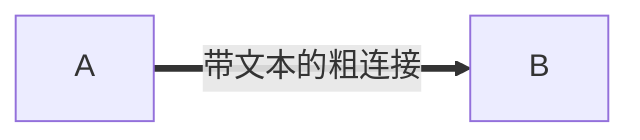


- （9）破坏语法的特殊字符

> 可以将文本放在引号内以便渲染更麻烦的字符

```java
graph LR
    id1["破坏语法的特殊字符!"]
```


- （10） 实体代码转义字符

```java
 graph LR
        A["这里有个引号#quot;"] -->B["特殊字符:#9829;"]
```

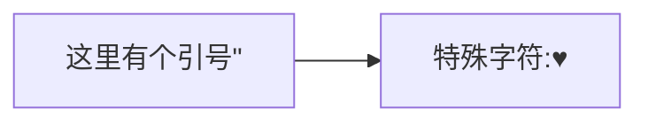


### 4、子图

语法：

```java
subgraph title
    graph definition
end
```


```java
graph TB
    c1-->a2
    subgraph one
    a1-->a2
    end
    subgraph two
    b1-->b2
    end
    subgraph three
    c1-->c2
    end
```

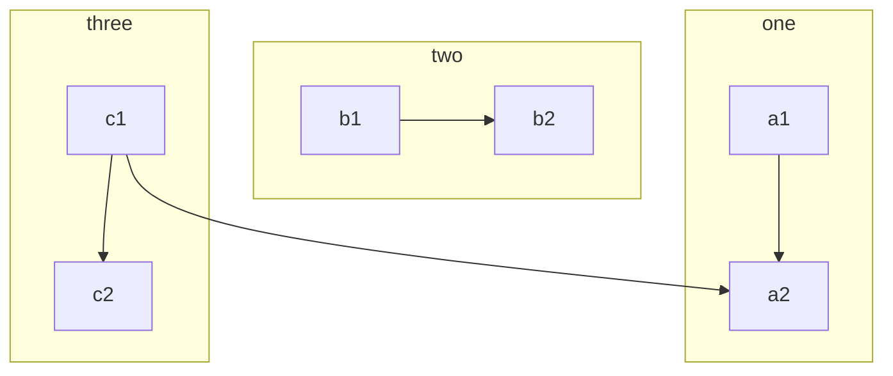


### 5、样式链接

```java
graph LR
    id1(Start)-->id2(Stop)
    style id1 fill:#f9f,stroke:#333,stroke-width:4px
    style id2 fill:#ccf,stroke:#f66,stroke-width:2px,stroke-dasharray: 5, 5
```

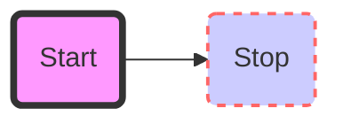


### 6、对fontawesome的基本支持

图标通过语法`fa：#icon class name＃`来获取

```java
graph TD
    B["fa:fa-twitter 和平"]
    B-->C[fa:fa-ban 禁止]
    B-->D(fa:fa-spinner);
    B-->E(A fa:fa-camera-retro 也许?);
```

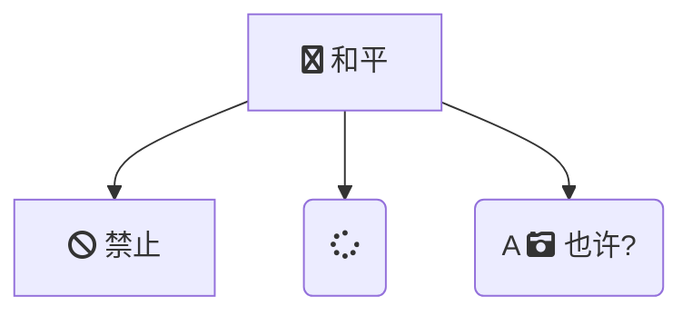


