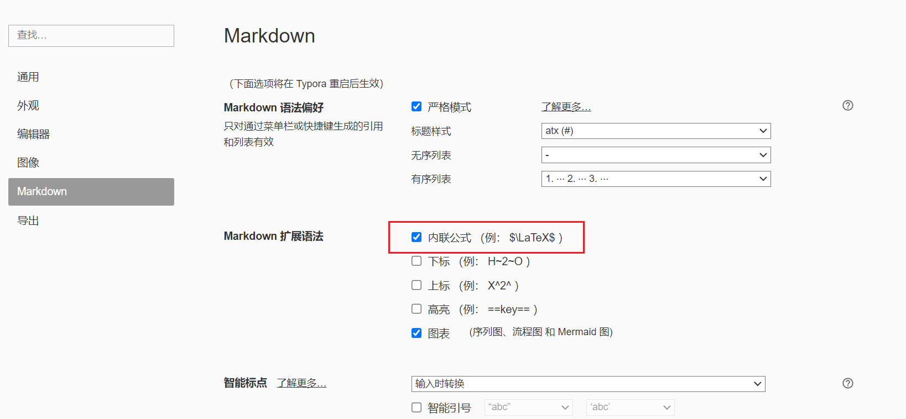

# 数学公式

## 1. 插入公式块

### 1.1 行内公式

```latex
关于变量$x$的函数$f(x)$
```

效果：

关于变量$x$的函数$f(x)$


### 1.2 公式块

```latex
$$
f(x) = ax+b
$$
```

效果：
$$
f(x) = ax+b
$$
注意：行内公式需要设置



## 2. 常用符号代码

### 2.1 常用数学表达式

| 数学表达式                        | LaTeX代码                       |
| --------------------------------- | ------------------------------- |
| $x^2$                             | x^2                             |
| $y_1$                             | y_1                             |
| $\infty$                          | \infty                          |
| $-\infty$                         | -\infty                         |
| $a+b-c*d$                         | a+b-c*d                         |
| $\times$                          | \times                          |
| $\cdot$                           | \cdot                           |
| $a\div{b}$                        | $a\div{b}                       |
| $\frac{a}{b}$                     | \frac{a}{b}                     |
| $a\pm{b}$                         | a\pm{b}                         |
| $\sqrt{b}$                        | \sqrt{b}                        |
| $\equiv$                          | \equiv                          |
| $\leq$                            | \leq                            |
| $\geq$                            | \geq                            |
| $\cdots$                          | \cdots                          |
| $\vdots$                          | \vdots                          |
| $\ddots$                          | \ddots                          |
| $\sin{\theta}$                    | \sin{\theta}                    |
| $\cos{\theta}$                    | \cos{\theta}                    |
| $\tan{\theta}$                    | \tan{\theta}                    |
| $\cot{\theta}$                    | \cot{\theta}                    |
| $\ln2$                            | \ln2                            |
| $\log_28$                         | \log_28                         |
| $\lg10$                           | \lg10                           |
| $\vec{F}$                         | \vec{F}                         |
| $\sum_{i=1}^{n}{a_i}$             | \sum_{i=1}^{n}{a_i}             |
| $\prod_{i=1}^{n}{a_i}$            | \prod_{i=1}^{n}{a_i}            |
| $\lim_{a\rightarrow+\infty}{a+b}$ | \lim_{a\rightarrow+\infty}{a+b} |
| $\bar x$                          | \bar x                          |
| $\overline{abc}$                  | \overline{abc}                  |
| $\forall$                         | \forall                         |
| $\emptyset$                       | \emptyset                       |
| $\exists$                         | \exists                         |
| $\partial$                        | \partial                        |
| $\nabla$                          | \nabla                          |
| $\bot$                            | \bot                            |
| $\angle$                          | \angle                          |
| $\because$                        | \because                        |
| $\therefore$                      | \therefore                      |
| $\in$                             | \in                             |
| $\notin$                          | \notin                          |
| $\subset$                         | \subset                         |
| $\subseteq$                       | \subseteq                       |
| $\int$                            | \int                            |
| $\infty $                         | \infty                          |
| $\cap$                            | \cap                            |
| $\bigcap$                         | \bigcap                         |
| $\cup$                            | \cup                            |
| $\bigcup$                         | \bigcup                         |

### 2.2 希腊字母

| 大写字母   | LaTeX    | 小写          | LaTeX       |
| ---------- | -------- | ------------- | ----------- |
| $A$        | A        | $\alpha$      | \alpha      |
| $B$        | B        | $\beta$       | \beta       |
| $\Gamma$   | \Gamma   | $\gamma$      | \gamma      |
| $\Delta$   | \Delta   | $\delta$      | \delta      |
| $E$        | E        | $\epsilon$    | \epsilon    |
|            |          | $\varepsilon$ | \varepsilon |
| $Z$        | Z        | $\zeta$       | \zeta       |
| $H$        | H        | $\eta$        | \eta        |
| $\Theta$   | \Theta   | $\theta$      | \theta      |
| $I$        | I        | $\iota$       | \iota       |
| $K$        | K        | $\kappa$      | \kappa      |
| $\Lambda$  | \Lambda  | $\lambda$     | \lambda     |
| $M$        | M        | $\mu$         | \mu         |
| $N$        | N        | $\nu$         | \nu         |
| $\Xi$      | \Xi      | $\xi$         | \xi         |
| $O$        | O        | $\omicron$    | \omicron    |
| $\Pi$      | \Pi      | $\pi$         | \pi         |
| $P$        | P        | $\rho$        | \rho        |
| $\Sigma$   | \Sigma   | $\sigma$      | \sigma      |
| $T$        | T        | $\tau$        | \tau        |
| $\Upsilon$ | \Upsilon | $\upsilon$    | \upsilon    |
| $\Phi$     | \Phi     | $\phi$        | \phi        |
|            |          | $\varphi$     | \varphi     |
| $X$        | X        | $\chi$        | \chi        |
| $\Psi$     | \Psi     | $\psi$        | \psi        |
| $\Omega$   | \Omega   | $\omega$      | \omega      |


### 3.1 简单矩阵

使用`\begin{matrix}...\end{matrix}`生成，每一行以`\\`结尾表示换行，元素间以`&`间隔，表达式的序号用`\tag{1}`  表示，示例：

```latex
\begin{matrix}
1 & 2 & 3 \\
4 & 5 & 6 \\
7 & 8 & 9 \\
\end{matrix} \tag{1}
```

效果：
$$
\begin{matrix}
1 & 2 & 3 \\
4 & 5 & 6 \\
7 & 8 & 9 \\
\end{matrix} \tag{1}
$$


### 3.2 带左右括号的矩阵

**方法一：**在 \begin{}和\end{}之后添加左右括号的代码

1. 大括号
   $$
   \left\{
   \begin{matrix}
   1 & 2 & 3 \\
   4 & 5 & 6 \\
   7 & 8 & 9 \\
   \end{matrix}
   \right\} \tag{2}
   $$

   ````latex
   \left\{
   \begin{matrix}
   1 & 2 & 3 \\
   4 & 5 & 6 \\
   7 & 8 & 9 \\
   \end{matrix}
   \right\} \tag{2}
   ````

   

2. 中括号

$$
\left[
\begin{matrix}
1 & 2 & 3 \\
4 & 5 & 6 \\
7 & 8 & 9 \\
\end{matrix}
\right] \tag{3}
$$


```latex
\left[
\begin{matrix}
1 & 2 & 3 \\
4 & 5 & 6 \\
7 & 8 & 9 \\
\end{matrix}
\right] \tag{3}
```


3. 小括号

$$
\left(
\begin{matrix}
1 & 2 & 3 \\
4 & 5 & 6 \\
7 & 8 & 9 \\
\end{matrix}
\right) \tag{4}
$$


```latex
\left(
\begin{matrix}
1 & 2 & 3 \\
4 & 5 & 6 \\
7 & 8 & 9 \\
\end{matrix}
\right) \tag{4}
```


**方法二：**修改\begin{matrix}和\end{matrix}中的{matrix}

1. 大括号：
   $$
   \begin{Bmatrix}
   1 & 2 & 3 \\
   4 & 5 & 6 \\
   7 & 8 & 9 \\
   \end{Bmatrix}
   $$

   ```latex
   \begin{Bmatrix}
   1 & 2 & 3 \\
   4 & 5 & 6 \\
   7 & 8 & 9 \\
   \end{Bmatrix}
   ```

   

2. 中括号

$$
\begin{bmatrix}
1 & 2 & 3 \\
4 & 5 & 6 \\
7 & 8 & 9 \\
\end{bmatrix}
$$

```latex
\begin{bmatrix}
1 & 2 & 3 \\
4 & 5 & 6 \\
7 & 8 & 9 \\
\end{bmatrix}
```


### 3.3包含希腊字母与省略号的矩阵

行省略号`\cdots`，列省略号`\vdots`，斜向省略号（左上至右下）`\ddots`。
$$
\left\{
\begin{matrix}
1 		& 2 		& \cdots & 5 		\\
6 		& 7 		& \cdots & 10 		\\
\vdots 	& \vdots 	& \ddots & \vdots 	\\
\alpha 	& \alpha+1 	& \cdots & \alpha+4 \\
\end{matrix}
\right\} \tag{5}
$$

```latex
\left\{
\begin{matrix}
1 		& 2 		& \cdots & 5 		\\
6 		& 7 		& \cdots & 10 		\\
\vdots 	& \vdots 	& \ddots & \vdots 	\\
\alpha 	& \alpha+1 	& \cdots & \alpha+4 \\
\end{matrix}
\right\} \tag{5}
```


### 3.4 行列式

与矩阵类似：
$$
\begin{vmatrix}
1 & 2 & 3 \\
4 & 5 & 6 \\
7 & 8 & 9 \\
\end{vmatrix}
$$


## 4. 表格

### 4.1 简易表格

$$
\begin{array}{|c|c|c|}
\hline 2 & 9 & 4 \\
\hline 7 & 5 & 3 \\
\hline 6 & 1 & 8 \\
\hline
\end{array}
$$

```latex
\begin{array}{|c|c|c|}
\hline 2 & 9 & 4 \\
\hline 7 & 5 & 3 \\
\hline 6 & 1 & 8 \\
\hline
\end{array}
```

**开头结尾**： `\begin{array}` ， `\end{array}`

**定义式**：例：`{|c|c|c|}`，其中`c` `l` `r` 分别代表居中、左对齐及右对齐。

**分割线**：①**竖直分割线**：在定义式中插入 `|`， （`||`表示两条竖直分割线）。

②**水平分割线**：在下一行输入前插入 `\hline`，以下图真值表为例。

其他：每行元素间均须要插入 `&` ，每行元素以 `\\` 结尾。


### 4.2 真值表

$$
\begin{array}{cc|c}
	       A&B&F\\
	\hline 0&0&0\\
	       0&1&1\\
	       1&0&1\\
	       1&1&1\\
\end{array}
$$

```latex
\begin{array}{cc|c}
	       A&B&F\\
	\hline 0&0&0\\
	       0&1&1\\
	       1&0&1\\
	       1&1&1\\
\end{array}
```


## 5. 格式

1. 多行等式对齐

$$
\begin{aligned}
a &= b + c \\
  &= d + e + f
\end{aligned}
$$

```latex
\begin{aligned}
a &= b + c \\
  &= d + e + f
\end{aligned}
```


2. 方程组、条件表达式

$$
\begin{cases}
3x + 5y +  z \\
7x - 2y + 4z \\
-6x + 3y + 2z
\end{cases}
$$

```latex
\begin{cases}
3x + 5y +  z \\
7x - 2y + 4z \\
-6x + 3y + 2z
\end{cases}
```


3. 条件表达式
   $$
   f(n) =
   \begin{cases} 
   n/2,  & \text{if }n\text{ is even} \\
   3n+1, & \text{if }n\text{ is odd}
   \end{cases}
   $$

   ```latex
   f(n) =
   \begin{cases} 
   n/2,  & \text{if }n\text{ is even} \\
   3n+1, & \text{if }n\text{ is odd}
   \end{cases}
   ```

   

4. 间隔（大小空格、紧贴）

紧贴 + 无空格 + 小空格 + 中空格 + 大空格 + 真空格 + 双真空格
$$
a\!b + ab + a\,b + a\;b + a\ b + a\quad b + a\qquad b
$$

```latex
a\!b + ab + a\,b + a\;b + a\ b + a\quad b + a\qquad b
```

| 样式说明 | LaTeX    |
| -------- | -------- |
| 紧贴     | `\!`     |
| 无空格   |          |
| 小空格   | `\,`     |
| 中空格   | `\;`     |
| 大空格   | `\`      |
| 真空格   | `\quad`  |
| 双真空格 | `\qquad` |


参考：

[【LaTeX应用】常用数学公式和符号](https://zhuanlan.zhihu.com/p/464237097)

[Latex对齐（align）入门教程](https://zhuanlan.zhihu.com/p/482828562) 


