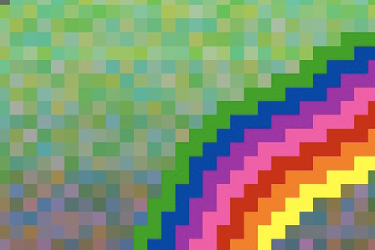
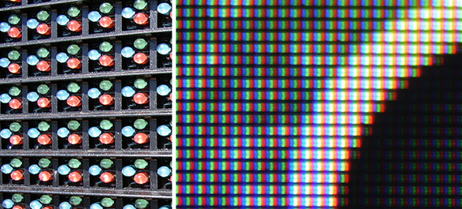
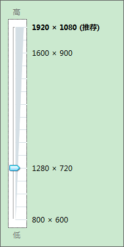

# 对屏幕的理解---分辨率，dpi，ppi，屏幕尺寸，像素 等

 

**1. 名词理解**

## 屏幕尺寸(screen size)

> 　　屏幕尺寸(screen size)，是屏幕的对角线长度，一般讲的大小单位都是英寸。

**DPI (dots per inch)**

> 　　**dpi** 是（英文Dots Per Inch）（每英寸所打印的点数）的缩写，是打印机、鼠标等设备分辨率的单位。国际上都是计算一平方英寸面积内像素的多少。这是衡量**打印机打印精度**的主要参数之一，一般来说，该值越大，表明打印机的打印精度越高。如果对于扫描设备，dpi越大，则采样点越高，扫描的图片越清晰。
>
> 　　可以理解为像素的密度，即单位面长度上的所打印点的数量。

**PPI (pixels per inch)**

> 　　PPI (pixels per inch)（每英寸的像素数量）的缩写

**像素(Pixel)**

> （1）对于数字图像来说　
>
> 　　简单的说，我们通常所说的像素，就是CCD/CMOS上光电感应元件的数量，一个感光元件经过感光，光电信号转换，A/D转换等步骤以后，在输出的照片上就形成一个点，我们如果把影像放大数倍，会发现这些连续色调其实是由许多色彩相近的小方点所组成，这些小方点就是构成影像的最小单位“像素”（Pixel）。如果这些感光点的是彩色像素点，把一个数字图像方法到一定程度，可以看到一个个像素点，如下图所示：
>
> 　　
>
> （2）对于硬件显示设备来说
>
> 　　对于计算机的屏幕设备而言，像素(Pixel)是一个最基本的单位，就是一个点。每一个显示设备（硬件）根据成像原理，目前广泛采用点阵显示。将任何的显示设备放大一定程度，可以看到基本都是有RGB三个小灯管组成一个像素的显示效果。
>
> 　　因为每个像素由RGB三个灯可以渲染任意的颜色显示。其它所有的单位，都和像素成一个固定的比例换算关系。所有的长度单位基于屏幕进行显示的时候，都统一先换算成为像素的多少，然后进行显示。
>
> 　　所以，就计算机的屏幕而言，相对长度和绝对长度没有本质差别。任何单位其实都是像素，差别只是比例不同。
>
> 　　硬件显示的设备度量单位就是实际的像素。
>
> 　　
>
> （3）实际打印机打印的点（DPI）
>
> 　　如果把讨论扩展到其它输出设备，比如打印机，**一般使用“像素”的概念表征，而是采用DPI的概念表示打印的尺寸**。因此基本的长度单位可能不是像素，而是其它的和生活中的度量单位一致的单位了，如英寸可打印都少点。此时就**不在用像素来度量，而是用实际的dpi来度量**

**分辨率**

　　说到像素就不得不说说分辨率了。因为两者密不可分！

> 　　所谓的“分辨率”指的是单位长度中，所表达或撷取的像素数目。和像素一样，分辨率也分为很多种。　
>
> **（1）影像分辨率**
>
> 　　我们通常说的数码相机输出数码照片的最大分辨率，指的就是影像分辨率，单位是**ppi（Pixel per Inch）。**
>
> 　　**指数字图像长的像素数量\*宽的像素数量，表示逻辑上图像的大小， 与实际的硬件无关。**
>
> **（2）打印分辨率**
>
> 　　顾名思义，就是打印机或者冲印设备的输出分辨率，度量单位是**dpi（dot per inch），关系到我们实际打印的照片的尺寸，其度量与实际长度相关。**
>
> 　　**在一英寸能够打印的点。与实际的长度一致。度量单位是DPI，这个值越大，打印照片越清晰。**
>
> **（3）显示器分辨率**
>
> 　　就是Windows窗口的桌面的大小。常见的设定有640x480、800x600、1024x768…等。指屏幕上垂直方向和水平方向上的像素个数。
>
> 　　**注意，****不是显示器的分辨率越大，像素越清晰，而是显示器对应的****DPI，这个DPI值越大，屏幕显示就越清晰。**
>
> 　　即**显示器的清晰度与屏幕的分辨率没有关系，而是与屏幕的密度有关，即屏幕密度就是DPI**。
>
> 　　因为，具有相同分辨率的显示器，如果二者的DPI不同，其清晰度效果也不同。因为如果两个屏幕的分辨率相同，即长宽的像素数量相同，但是DPI不同，即DPI大的，单位英寸的显示点多，其对应的屏幕尺寸必然越小。,
>
> **（4）屏幕字型分辨率**：PC的字型分辨率是96dpi，Mac的字型分辨率是72dpi。

 ***\*2. 名词相关关系\****

　　**屏幕分辨率， 屏幕DPI， 屏幕尺寸，图像分辨率之间的关系**

> **（1）屏幕尺寸表示屏幕的大小，屏幕DPI表示屏幕像素密度，屏幕分辨率表示在XY方向的可视点数，图像分辨率表示图像在逻辑上的像素数量；**
>
> **（2）如果屏幕DPI一定，则屏幕尺寸与屏幕分辨率成正比，即屏幕尺寸越大，则屏幕分辨率越大， 且屏幕尺寸不同，且屏幕分辨率也必然不同；**
>
> **（3）如果屏幕尺寸一定，则屏幕DPI与屏幕分辨率成正比，即屏幕DPI越大，则屏幕分辨率越大，且DPI不同，则屏幕分辨率也必然不同；**
>
> **（2）图像在屏幕上显示效果与这四个变量都有关系：**
>
> -  ***\*“屏幕尺寸”“屏幕DPI”“屏幕分辨率”\**一定，则图像分辨率越大，则图像越清晰；**
>
> - 图像分辨率一定
>
>   ，**输出到不同的显示器中，呈现的效果“屏幕尺寸”“屏幕DPI”“屏幕分辨率”三者有关，**
>
>   - ***\*假定屏幕尺寸相同，\**如果两个显示器的DPI相同，则分辨率大的图像显示的较小，且显示效果清晰；反之，显示器分辨率小的图像显示大；**
>   - ***\*假定屏幕尺寸相同，\**如果两个显示器的DPI不同**，则屏幕的分辨率也必然不同， 则图像在两个屏幕上显示的效果一样，即大小和清晰度一样。
>
> **这是日常生活中相同尺寸的电视屏幕清晰度差异很大，或者屏幕大小尺寸相同的手机，清晰度显示效果也不同的现象的本质问题！！！**
>
> **转载请告知 www.icmzn.com**

　　**数码相机像素与影像分辨率**

> 　　通常来说200万像素的数码相机，最大影像分辨率是1600×1200＝192万像素，也就是说，实际的有效像素就是192万。
>
> 　　通常所说的300万像素的数码相机，最大影像分辨率是2048×1536＝3145728像素，也就是说有效像素为314万。
>
> 　　因此数码相机中的像素越高，输出的影响分辨率也就越大。

 　**打印分辨率和像素（DPI）的关系**

> 　打印尺寸的计算方式：
>
> 　　如一个200万像素的数码相机，可以输出200万像素的数码照片，最大输出1600×1200的数码照片。如果彩色打印机的分辨率是300DPI，则
>
> 　　宽：1600 Pixels/300 dpi=5.3 英寸
>
> 　　高：1200 Pixels/300 dpi=4 英寸
>
> 也就是说如果用300dpi输出分辨率冲印，最多能冲印5.3×4英寸的照片。
>
> 但是，实际的照片尺寸长宽是有固定比例的，即，5寸照片：高5寸×宽3.5寸　；6寸照片：高6寸×宽4寸。因此要按照输出照片的尺寸笔记进行等比例缩放，即最大能输出5寸照片：高5寸×宽3.5寸 的照片。
>
> （注：人眼能分辨出的最大分辨率是300dpi，超过这个分辨率，人的眼睛是无法看出差别的，也就是说300dpi和600dpi在人眼看来是没有差别的，所以现在的冲印设备最大的设计输出分辨率，就是300dpi，当然每个人对于清晰度的要求是不一样的，一般来说能达到200dpi就能让大部分人满意。
>
> 所以200万像素只能完美冲印最大5寸照片，但是，如果冲印6寸的照片，在大部分人看来还是很清晰的仍然是可以接受的。）

3， 应用

【1】在PS处理中，处理数码照片，用于彩色**打印，如何通过DPI、像素、尺寸判断打印清晰度呢**

（1）指定尺寸的照片，需要设置图片像素大小？

　　我想打印一副 8 英寸 x 10 英寸，300 Dpi 的图片，那么怎样设置图像的像素长宽度呢？你只要简单地把这两者相乘就可以了，如果用方程表示，就是：
　　**像素 = 英寸 x Dpi**

　　所以，对于上面的情况：显示屏图片像素宽度 = 8 英寸 * 300 Dpi显示屏图片像素高度 = 10 英寸 * 300 Dpi所以，这就应该是一副宽 2400 像素，高 3000 像素的图片。

 （2）已知像素数量，求图片英寸（尺寸）大小

 　在这个方程中，知道了像素和Dpi，就能知道英寸大小。

　　**英寸 = 像素 / Dpi**

　　比如说，有人发给我一副网站上下载的图片，**900\*600 像素**，如果我想知道它在 300Dpi 下有多大，我就可以进行如下的换算：成品图片尺寸高度 = 900 像素 / 300Dpi成品图片尺寸宽度 = 600 像素 / 300Dpi经过计算就可以知道它应该是3英寸高，2英寸宽。

 【2】屏幕的清晰度如何判定

　　PC重新装系统后，屏幕可能变模糊，屏幕中的字和图像会产生颗粒感。

　　这是因为屏幕的分辨率没有适配显示器的DPI。

　　如果是192*1080分辨率的显示设置，调整为1280*720分辨率，则显示的字体会变大，且不清楚，并且字体会产生颗粒感。因为设置为低分辨率输出，则显卡输出的每帧屏幕的分辨率就是1280*720像素，这个是影像分辨率，表示像素逻辑上的多少。即低分辨了的图像显示在高DPI的屏幕上且屏幕分辨率比图形分辨率大，则如果图像要铺满整个屏幕，则显示的数码图片会被放大，因此会产生马赛克效应，即图像模糊。

　　

 

endl;

 

参考网址：

　　https://99designs.com/blog/tips/ppi-vs-dpi-whats-the-difference/

　　