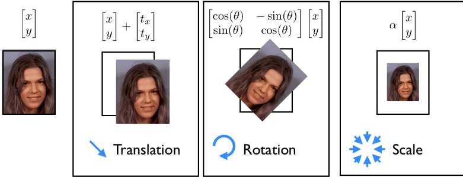
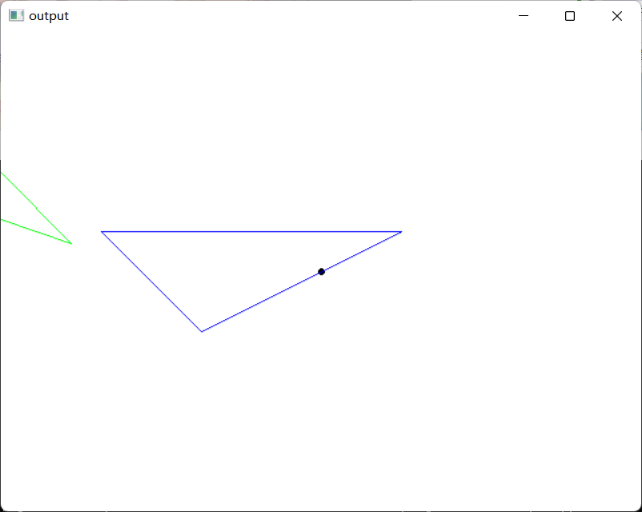
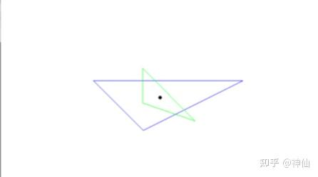
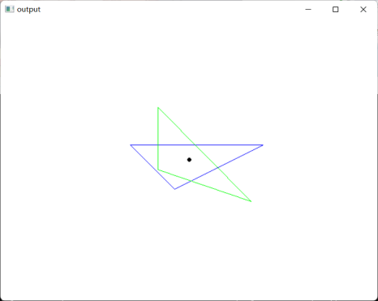
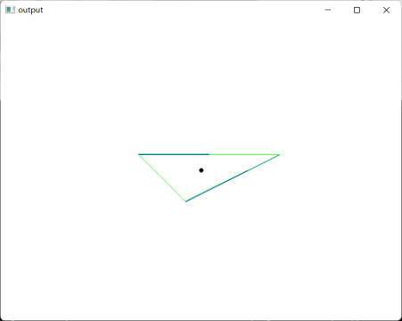
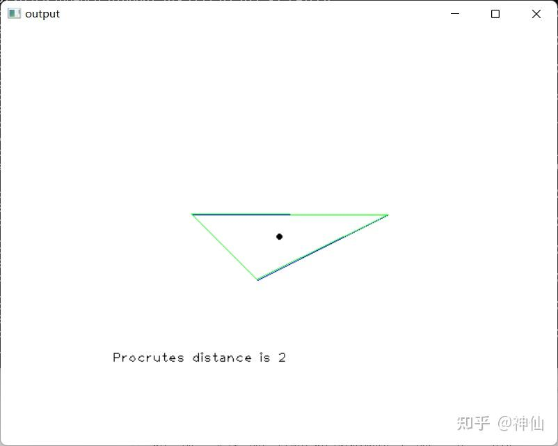

# 最通俗易懂的Procrustes分析教程

自学到Procrustes analysis，不知道网上那些写的什么玩意，一模一样的文章搬来搬去，错的都一模一样，最后多方学习终于弄懂了。参阅Wiki结合自身代码，写了篇文章给大家参考。以下为正文：

## 1、基本介绍

为了比较两个或者更多的形状，对象必须首先被最佳地重叠起来。**[普氏重叠](https://zhida.zhihu.com/search?content_id=190735437&content_type=Article&match_order=1&q=普氏重叠&zhida_source=entity)**（Procrustes superimposition, PS）是一种**平移**、**旋转**和**缩放**物体的方法。通过最小化[普氏距离](https://zhida.zhihu.com/search?content_id=190735437&content_type=Article&match_order=1&q=普氏距离&zhida_source=entity)（一种形状差异的量度，类似于欧氏距离，后文会介绍），自由调整对象的位置和大小，使得多个对象尽可能重叠，这通常被称为**全普氏重叠**（full PS）。与之相对还有**部分普氏重叠**（partial PS），它只进行平移旋转而不会缩放。举个栗子，对于两个半径不同的圆，在full PS处理后，它们会完全重合。而在partial PS之后只会有位置的重合，两个圆的原始大小并不改变。

## 2、普通Procrustes分析

在n维空间中取定k个有限的点。通常，这些选自于复杂物体的连续表面（例如人脸）上的点被称为关键点（landmark points）。




（来自网络）

### 2.1. 平移（Translation）

平移分量可以通过平移对象从对象中移除，以便所有对象点的均值（即其质心）位于原点。从数学上说：在二维空间取k个点，有 ，那么质心： 

现在平移这些点使得他们的质心与原点重合： 。为方便起见，将原点移到中间。如下图所示：




原始图像



平移后

### 2.2 统一缩放（Uniform scaling）

同样，可以通过缩放对象来移除缩放分量，从而使从点到平移原点的均方根距离 （the Root Mean Square Distance, RMSD, 即标准差） 为 1。当点坐标除以RMSD后，缩放尺度变为1： 




统一缩放后（注意：此图放大了100倍）

### 2.3 旋转（Rotation）

移除旋转分量稍微要复杂一些，因为没有所谓标准的参考方向。考虑由相同数量的点组成的两个对象，其中删除了比例和平移。 设这些点为 和 ，且其中一个对象可以作为参考方向。 固定参考对象（以固定xy为例）并围绕原点旋转另一个，直到找到最佳旋转角度使得对应点之间的平方距离之和 (the Sum of the Squared Distance, SSD, 即欧氏距离之和) 最小化。

旋转角度后得到： ，即 ，其中uv是旋转后坐标

对求导并解出得到： 




旋转后

而当对象为三维时，最佳旋转由 3×3 旋转矩阵 R 表示，而不是简单的角度，在这种情况下，可以使用[奇异值分解](https://zhida.zhihu.com/search?content_id=190735437&content_type=Article&match_order=1&q=奇异值分解&zhida_source=entity)来找到 R 的最佳值。


### 2.4 形状比较（Shape comparison）

只有在通过最佳平移缩放旋转后重叠两个对象才能够评估两个对象形状的差异。上述对应点之间的SSD可以作为这种形状差异的统计量度，通常也被成为**普氏距离**（**Procrustes distance, PD**）：


于是，PD越小则代表图形形状相似度越高。

在本例中的结果约为2




### 2.5 重叠更多的形状

以上只介绍了如何重叠两个图形，但是同样的方法也可以应用于更多的图形，只要反复运用上述处理即可。然而，[广义普氏分析](https://zhida.zhihu.com/search?content_id=190735437&content_type=Article&match_order=1&q=广义普氏分析&zhida_source=entity)提供了更好的方法来达到这个目的。


## 3. 广义普氏分析（Generalized Procrustes analysis, GPA）

GPA 应用普氏分析方法来优化叠加一组对象，而不是将它们叠加到任意选择的形状上。

广义和普通普氏分析的不同之处仅在于它们确定的参考方向。在前一种技术中参考方向氏是算法计算出最佳地，而在后一种技术中是任意选择的。 两种技术以相同的方式执行缩放和平移。 当只比较两个形状时，GPA 相当于普通的普氏分析。

算法大纲如下：

1、任意选择参考形状（通常在可用实例中选择）

2、将所有实例叠加到当前参考形状

3、计算当前叠加形状集的平均形状（结合点分布模型）

4、如果平均形状和参考形状之间的普氏距离高于阈值，则以平均形状为参考并继续执行步骤 2。

------


## 4. 完整代码

```cpp
#include <opencv2/imgproc.hpp>
#include <opencv2/highgui.hpp>
#include <vector>
#include <numeric>
#include <format>
#define CANVAS_W 640
#define CANVAS_H 480
using namespace std;
using namespace cv;
Point origin(CANVAS_W / 2, CANVAS_H / 2);
template <random_access_iterator It>
auto average(It first, It last) {
	return make_pair(std::accumulate(first, last
		, 0.0, [](double val, const Point& p) { return val + p.x; }) / std::distance(first, last),
		std::accumulate(first, last
			, 0.0, [](double val, const Point& p) { return val + p.y; }) / std::distance(first, last));
}

template <random_access_iterator It>
double RMSD(It first, It last, double aver_x, double aver_y) {
	return sqrt(std::accumulate(first, last, 0.0, [&](double val, const Point& p) {
		return val + pow(p.x - aver_x, 2) + pow(p.y - aver_y, 2);
		}) / std::distance(first, last)) / 100.0;
}

template <random_access_iterator It>
double Procrutes_distance(It first1, It last1, It first2, It last2) {
	return sqrt(std::accumulate(first1, last1, 0.0, [&](double val, const Point& p) {
		double res = pow(p.x - first2->x, 2) + pow(p.y - first2->y, 2);
		++first2;
		return val + res;
		}));
}
int main() {
	Mat img(Size(CANVAS_W, CANVAS_H), CV_8UC3, Scalar(255, 255, 255));
	circle(img, origin, 2, Scalar(0, 0, 0), 2);
	vector<Point> xy_points{ {100,200}, {200,300},{400,200} }, wz_points{ {-35,106}, {-35,176},{70,212} };
	assert(xy_points.size() == wz_points.size());

	auto [aver_xyx, aver_xyy] = average(xy_points.begin(), xy_points.end());
	auto [aver_wzx, aver_wzy] = average(wz_points.begin(), wz_points.end());


	double xy_rmsd = RMSD(xy_points.begin(), xy_points.end(), aver_xyx, aver_xyy),
		wz_rmsd = RMSD(wz_points.begin(), wz_points.end(), aver_wzx, aver_wzy);

	double num = 0.0, den = 0.0;
	for (int i = 0; i < xy_points.size(); ++i) {
		num += wz_points[i].x * xy_points[i].y - wz_points[i].y * xy_points[i].x; //wy-zx
		den += wz_points[i].x * xy_points[i].x + wz_points[i].y * xy_points[i].y; //wx+zy
	}
	double theta = atan(num/den);


	for_each(xy_points.begin(), xy_points.end(), [&](Point& p) { p.x = origin.x + (p.x - aver_xyx) / xy_rmsd, p.y = origin.y + (p.y - aver_xyy) / xy_rmsd; });
	for_each(wz_points.begin(), wz_points.end(), [&](Point& p) {
		double w = (p.x - aver_wzx) / wz_rmsd, z = (p.y - aver_wzy) / wz_rmsd;
		p.x = origin.x + w*cos(theta)-z*sin(theta), p.y = origin.y + w * sin(theta) + z * cos(theta);
		});

	double d = Procrutes_distance(xy_points.begin(), xy_points.end(), wz_points.begin(), wz_points.end());

	polylines(img, xy_points, true, Scalar(255, 0, 0));
	polylines(img, wz_points, true, Scalar(0, 255, 0));
	putText(img, String(std::format("Procrutes distance is {}", d)), Point(CANVAS_W * 0.2, CANVAS_H * 0.8), FONT_HERSHEY_PLAIN, 1, Scalar(0, 0, 0));
	imshow("output", img);
	waitKey(0);
}
```