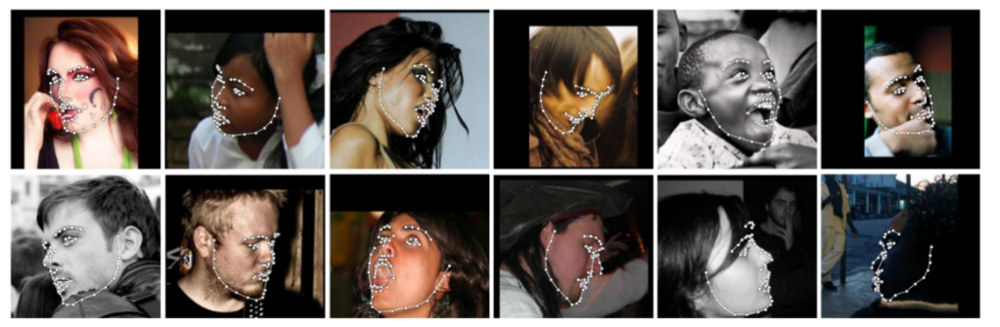
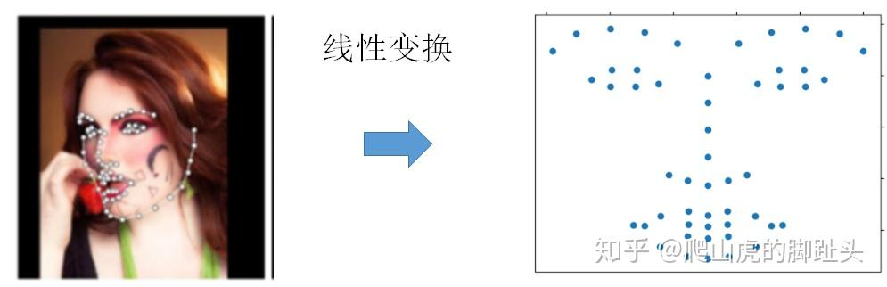
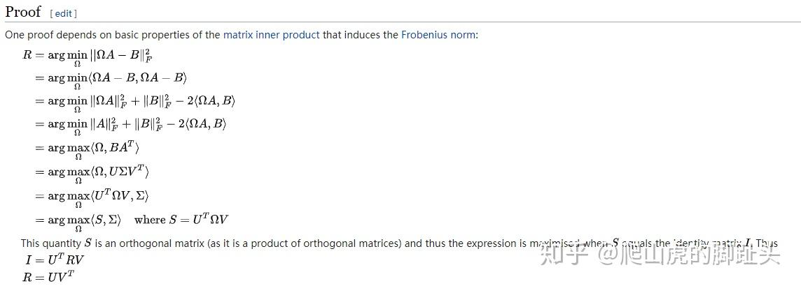
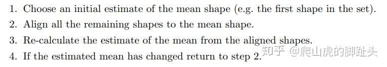
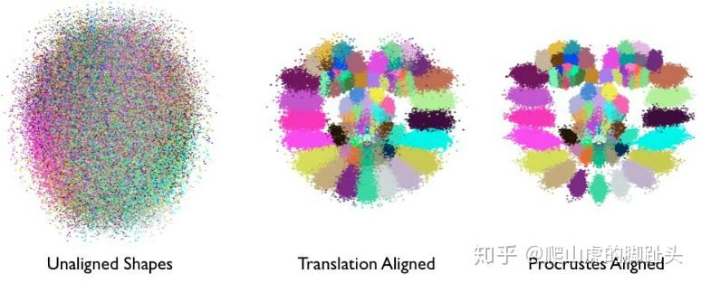
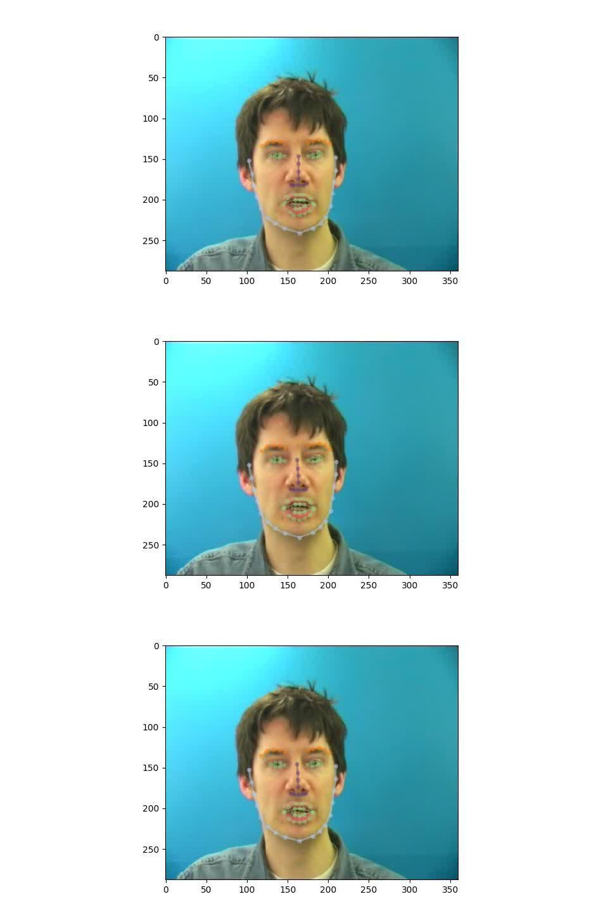

# 人脸图像变换的Procrustes analysis

事情的起因是这样的，我们可以利用[模型检测](https://zhida.zhihu.com/search?content_id=142164202&content_type=Article&match_order=1&q=模型检测&zhida_source=entity)人脸的关键点，利用这些关键点就可以作为特征输入模型进行一些处理。但是视频中人动来动去的，因为人在视频中位置，远近，角度都有可能不一样。Procrustes analysis[1]的作用就是对这些关键点进行规整化，得到一致的处理结果。

和完整的[仿射变换](https://zhida.zhihu.com/search?content_id=142164202&content_type=Article&match_order=1&q=仿射变换&zhida_source=entity)不同，Procrustes analysis考虑3种变换，第一是平移，第二是整体缩放，第三是旋转。这三种变换组合得到的图形我们认为是等价的，Procrustes analysis的目标就是对图像进行这样的变换后得到一个等价的图形，这个等价的图形距离一个参考图形的距离最近。平移可以通过计算平均值，然后对点进行归一化计算；整体缩放可以计算出点的方差，然后对方差进行[归一化](https://zhida.zhihu.com/search?content_id=142164202&content_type=Article&match_order=2&q=归一化&zhida_source=entity)计算；旋转稍微麻烦一点，可以通过估计一个[正交矩阵](https://zhida.zhihu.com/search?content_id=142164202&content_type=Article&match_order=1&q=正交矩阵&zhida_source=entity)R，使得经过R矩阵变换后的点和参考图形距离最近。R矩阵计算可以先求出两个图形的[协方差矩阵](https://zhida.zhihu.com/search?content_id=142164202&content_type=Article&match_order=1&q=协方差矩阵&zhida_source=entity)，然后SVD分解，R=UV^T。背后的原理是这样的

引用自维基百科[2]

其实这个证明和PCA的一个出发点很像，PCA的一个理解是经过一个正交基变换后得到的数据再反变换回来和原来的误差最小，优化目标为 。因此都是从一个最小距离的准则出发，得到最优的[旋转矩阵](https://zhida.zhihu.com/search?content_id=142164202&content_type=Article&match_order=1&q=旋转矩阵&zhida_source=entity)（或者说一个正交矩阵）的参数估计。

人脸的[图像归一化](https://zhida.zhihu.com/search?content_id=142164202&content_type=Article&match_order=1&q=图像归一化&zhida_source=entity)可以使用一个标准脸，然后把所有得到的关键点标注往标准脸方向进行转换。这个标准脸可以从一个C++处理图像和人脸的工具dlib[4]里面得到。如果没有标准图像，就可以使用Generalized Procrustes Analysis (GPA)通过迭代，求得一个标准图形（canonical shape）。方法也比较简单。我们可以选择，比如所有图形中任意一张作为迭代初始化的标准图形，然后把所有的图像转换到这个标准图形上去。然后用转换后的所有图像求一个平均图形，可以直接求平均得到。然后再次迭代，直到两次得到的标准图形相差小于一个阈值。

GPA算法的流程 [5]

举个 ，这张图就生动的展示了经过普氏分析的人脸集合

没有归一化的人脸比较散乱，经过translation aligned就是经过了平移归一化后的人脸，经过普氏分析得到的归一化人脸可以明显的看出人脸集合中眼睛，鼻子，脸的轮廓。

普氏分析是人脸标准化的一个重要步骤。一般人脸自动检测得到的关键点还有抖动问题，这个是因为模型的误差引起的。怎么解决这个问题呢？

我们需要对人脸进行[空域](https://zhida.zhihu.com/search?content_id=142164202&content_type=Article&match_order=1&q=空域&zhida_source=entity)和时域的滤波，以去除自动标记点的噪声问题。对于空域滤波，我们先对所有的图形进行平移和缩放的归一化计算，然后把得到的图形进行PCA分析，得到主成分。然后采用[降维](https://zhida.zhihu.com/search?content_id=142164202&content_type=Article&match_order=1&q=降维&zhida_source=entity)的方法，保留主成分，剔除噪声成分，然后恢复得到去噪的标记。[空域滤波](https://zhida.zhihu.com/search?content_id=142164202&content_type=Article&match_order=2&q=空域滤波&zhida_source=entity)以后的标记点空间上相对位置会变得更加平滑，比如人脸的轮廓会保持一个平滑的曲线，而未滤波前，人脸检测轮廓可能出现不自然的毛刺。对于时域滤波，可以选取相邻时刻的标记进行平滑处理，使用一个简单的[均值滤波器](https://zhida.zhihu.com/search?content_id=142164202&content_type=Article&match_order=1&q=均值滤波器&zhida_source=entity)就可以了。经过时域滤波，检测点会在时间上变得平滑，比如相邻时刻检测点不会发生突然不自然的跳变，而未滤波前，检测点可能会反复抖动，这一点感知是非常明显的。对于人脸的空时滤波算法和代码，可以参考[6]。里面提供了非常好的[可视化](https://zhida.zhihu.com/search?content_id=142164202&content_type=Article&match_order=1&q=可视化&zhida_source=entity)和详细处理的代码。

下面这个视频就是经过空时滤波的一个例子。

[知乎视频1406 播放 · 0 赞同视频](https://www.zhihu.com/zvideo/1294006523556405248)

因此，我们通过以上的办法进行[预处理](https://zhida.zhihu.com/search?content_id=142164202&content_type=Article&match_order=1&q=预处理&zhida_source=entity)，就可以得到标准化的标记数据了。总结一下流程。首先，估计PCA参数，对标记点进行空域滤波。然后使用一个均值滤波器，对标记点进行时域滤波。最后，使用普氏[分析法](https://zhida.zhihu.com/search?content_id=142164202&content_type=Article&match_order=1&q=分析法&zhida_source=entity)把去噪后的标记点标准化，得到最终的处理结果。

参考文献

[1][https://en.wikipedia.org/wiki/Procrustes_analysis](https://en.wikipedia.org/wiki/Procrustes_analysis)

[2][https://en.wikipedia.org/wiki/Orthogonal_Procrustes_problem](https://en.wikipedia.org/wiki/Orthogonal_Procrustes_problem)

[3][Affine transformation · Issue #18 · Fengdalu/LipNet-PyTorch](https://github.com/Fengdalu/LipNet-PyTorch/issues/18)

[4][https://github.com/davisking/dlib/blob/883101477d2485ae6e0e8499ec0eefb8382fcb5a/dlib/image_transforms/interpolation.h](https://github.com/davisking/dlib/blob/883101477d2485ae6e0e8499ec0eefb8382fcb5a/dlib/image_transforms/interpolation.h)

[5][https://graphics.stanford.edu/courses/cs164-09-spring/Handouts/paper_shape_spaces_imm403.pdf](https://graphics.stanford.edu/courses/cs164-09-spring/Handouts/paper_shape_spaces_imm403.pdf)

[6][Animating and Smoothing 3D Facial Keypoints](https://www.kaggle.com/selfishgene/animating-and-smoothing-3d-facial-keypoints/notebook)