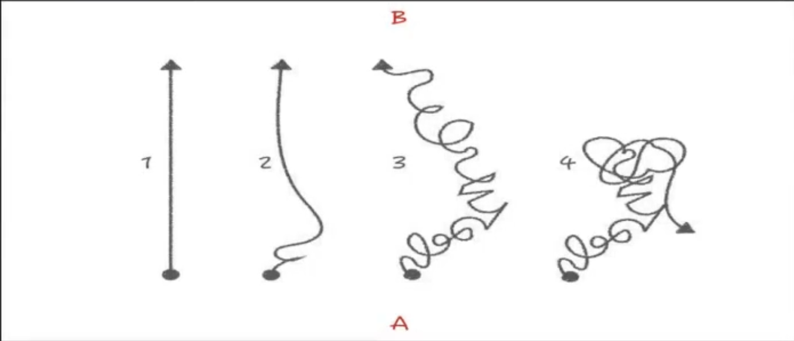
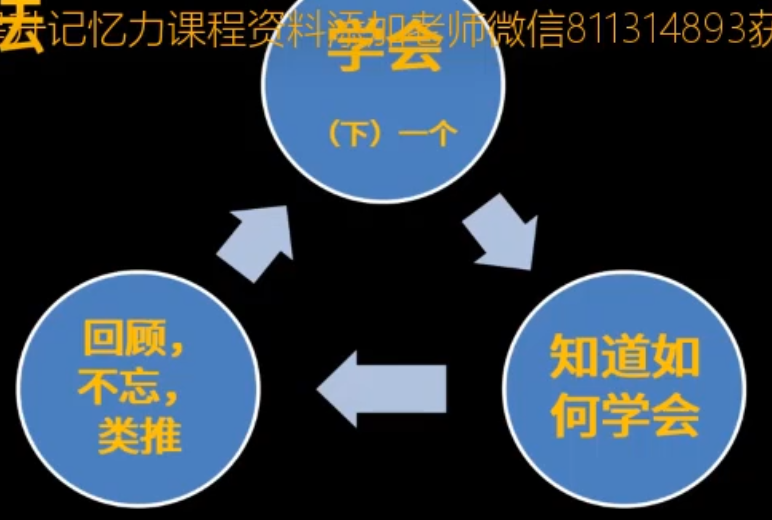

# 费曼学习法

## 1.参考书目

绝非天赋-斯科特.考夫曼

如何高效学习-斯科特.杨

关键20小时，快速学会任何技能-考夫曼

从0到1 开启商业与未来的秘密 - 彼得·蒂尔 布莱克·马斯特斯

不得贪胜-李昌镐

童年的秘密-蒙台梭利

## 2. 学习的过程

学习的过程就是A -> B， 分成4种

1.  直接过去 A到B，不怎么拐弯。超级学习者，效能奇高
2. 开始时探索、摸索、碰壁，一段时间后找到最优路径，达到目标
3. 一直碰壁，曲曲折折，最终达到目标，但是时间精力浪费很大
4. 没有到达目标，始终受挫。比例很大

## 3. 学习的方法

费曼:

> 费曼(Rechard.Feynman)送给妹妹的一句话，让她成为天文学家：
>
> “你从头读，尽量往下读，直到你一窍不通时，再从头开始，这样坚持到完全读懂为止。”

李昌镐:

>  如果有句子或者单词不理解，我就绝不会跳到下一行。有时候我读两三行就需要5-10分钟，同一句子，同一页文章，我会读一遍又一遍，真是无可奈何的“蜗牛”学习法

**缓慢的精细地加工所学的东西**，也就是99.9%的人受不了的慢，恰恰是高效能学习的秘诀

很多人为什么受不了慢？就是急功近利，想要学的更多，急忙往前赶，后面就会不断被卡，是因为前面的学习得不牢固，总是遗忘，都模模糊糊了，后面的东西理解不了，学了很多消化不了，最终一次一次返工。

蒙台梭利:

> 天才来自重复，正常化来自重复

厚达600页的教育学著作翻译（英文->意大利文）一遍，抄写两遍，为的就是反反复复，把思想、理论、知识装进自己的大脑。她的教育研究来自于她发现儿童会一百遍、两百遍的操作一个教具（儿童的特殊的玩具），这就是开启心智大门的重要法门。

核聚：

>  读蒙台梭利的童年的秘密，涉及的知识太广，读不懂，只能反反复复读，一遍一遍做笔记，做了200遍，一个星期读了200遍

看上去如此愚蠢如此笨的学习方法就是极高效能学习方法

## 4. 思维模型

1. 学会 

   学会 一个单词、一句话、一个技能、一道题目、一个公式 就可以

2. 知道如何学会的

   一个单词写了多少遍、读了多少遍、默写了多少遍才学会的，一道题目开始不会，后来明白了，是怎么弄明白的，是重复了多少遍，还是给别人讲，还是查背后的知识细节等。搞明白是怎么学会的。

3. 不要忘了所学的知识

   费曼告诉妹妹：学习的过程中卡住了就要从头开始。 原因就是学习过程中会遗忘，会把之前的东西忘掉了，把理解这些各种知识的**思维过程**忘记了，模糊，造成后面的学习困难。卡住之后最好的方法就是回顾，把以前的东西捡回来。回顾的目的是为了不忘，把前面的知识捡回来。

   >  对于同一个知识，每个人的理解过程都不一样，自己学习弄懂**某个知识的思维过程**非常重要，要记下来。

以此类推，如何学会前一个知识，就如何学会下一个知识，循环往复。这就是高效能学习的核心算法。

## 5. 原理

知识的高度可压缩性和残酷性

### 5.1 知识都是高度可压缩的

学会一个知识=学会10000个知识

**知识有排列组合爆炸的属性**

例如 勾股定理的知识就是平方、加减乘除四则运算、三角形几何知识等知识的组合

基本知识进行排列组合就会组成各种各样的定理、命题。组合的数量是爆炸性的。

所有的数学定理的根源都是几条最基本的定义和公设，如欧几里得集合就是5条公设+十几个简单的定义。

### 5.2 知识的残酷性

忘记一个知识=忘记10000个知识

大部分人效能低下都是不熟练造成的。之前的知识忘记了，对之前的知识不熟练，就会一次一次的返工。忘记一个知识就等于忘记成千上万个知识。之后的学习会不断的卡住，造成低效能。

4种学习方法中，第一种的学习路线为什么能直接到达目标？

因为核心算法只有一种：知道如何学会一个东西，还知道是如何学会的，之前学习的知识不要忘记，以此类推。就是数学归纳法。

### 5.3 科学原理

web of memory ： 如果你真的想记住什么，请在一天之内完成，如果完不成，必须要在24小时内复习。

原因是当在24小时内记住一个知识的时候，知识会存储在同一个神经元群体中。

如果想记住一个知识，但是没记住，在此后24小时内又没有复习，那么以后即使很努力的记住了，例如web of memory 这个概念， 但是这个概念会存储在不同的神经元群里面，那就意味着提取的时候更困难。

形象的理解：

烧开水的例子，理论上可以使用无穷无尽的时间和能源，却烧不开一壶水，如何操作：每次当水烧到五六十度就拔掉电源，然后水就凉了，水凉了之后再插上电源再烧到五六十度，然后再拔掉电源......

这样用无穷无尽的时间和能源永远也烧不开一壶水。

绝大多数人的学习就是这样操作的，只是学习的过程比较困难和复杂，看不见这个过程。这就是十几年的时间也学不好英语的根本原因。浪费无穷无尽的时间和精力。

## 6. 学习的过程

学的的过程容易受挫，**容易受挫，是因为低估了事情的难度，学习比建大楼还要难！**

建大楼时，根基不牢，地动山摇，必须要把根基弄得很牢，然后一层一层，一砖一瓦，高度精准的摆放。然后大楼才不会塌。

学习的时候，之前学习的知识，一个单词、一个句子、一遍文章、一道题目，不及时复习的话，就会遗忘，就会模糊，知识不是一次成型的。无论学什么都要像费曼那样，一而再，再而三的回顾。就像李昌镐那样，三两句话，三五分钟、十分钟在重复，读到后面，前面又忘了，只能回来再重复。不断回来打地基。

**学习，无论学什么知识，它比盖大楼还要难。**

>  高效学习的秘诀：必须要**百分之百**的扎扎实实掌握所学。

百分之百概念无比重要。比如一个数学公式不是百分之百记住了，后面做题就会很容易卡住。

整个学习过程又是很高效的。所以说还要急速推进

**要百分之百扎扎实实的掌握所学，又要急速推进，那么必然导向的操作就是随时随地的复习！**

**若想要急速推进，就必须高频回顾**

**缓慢的精细加工，是高效能的必经之路**

这么做的人不足千分之一，学着学着就思维混乱，不了了之。

>  “反者，道之动” -- 《道德经》

循序渐进的学习，适用于任何考试实战！

1. 看似进度很慢（许多人因为进度焦虑，所以很多人放弃了这种方法，这是巨大的损失）
2. 正确率明显提升
3. 理解力明显增强
4. 信心大增
5. 从学业精进到人生精进

例如：计算机考研学习数据结构

> 以前一看到这种题目就蒙圈，根本没有任何思路，任何想法，现在发现把每一个操作定义都掌握了，通过简单的排列组合就可以把算法题目都解决了。同样发现概率论数理统计知识也可以用同样的方式解决掉。

所以看是很慢、很愚蠢的方式，踏踏实实的去掌握，一点一滴的去学，就是高效能的学习方法。

如果想要真的学习的话，只能这么学，没有第二种方法。只能这么学，一步一步扎扎实实学。

而这样恰恰就是最强悍，最高效的学习方法。

> 大道至简，不繁，很难

大多人太急功近利，太浮躁了，总想着考清华北大，迅速拿到XX证，可是没有学到真东西，没有真的去学习的话，怎么能拿到呢？

## 7.思考

1. 费曼的终极学习法（读书法）是什么？
2. 学习的核心算法是什么？
3. 学习效率地下的根本原因是什么？
4. 这节课的内容一次听下来之后，还记得多少？
5. 为什么很多聪明人过得很失败？

## 8. 扩展

考试就是思维空间的圈地战争，最常出现的情况是得而复失。最高效的做法：

- 必须100%掌握一个一个的知识点，彻底掌握一道一道题目。

  不要留任何尾巴。哪怕是标点符号也要彻底弄清楚。

  

- 一个知识点（题目）不只是一个知识点（题目），而是千万个，因为你会成千上万次遇到。

		一定要记住，为什么花这么大力气掌握一个点是值得的。因为一点不仅仅是一个点，它是成千上万个，如果没有掌握牢的话，后面会反复被这个点卡住，后面就会从失望到绝望。所以从开始就认识到这点，杜绝这种情况的发生。

- 必须步步为营，牢牢把握住自己能掌握的任何东西，再不断的扩大范围。
- 熟悉这个套路后，迅速的找到未开垦的区域，迅速占领。

一方面不断的频繁回顾，巩固自己的大后方，另一方面就是任何零散的时间都可以向前推进。

以上4点原则上所有人都能做到，只是实际上做到的人很罕见。

上述方法不仅仅是高效能的方法，也是奔满分的方法，很多考试不去接近满分的话，想要考到极端好的效果是不可能的。

反证法：没有任何原理证明你拿不到满分，因此，你一定有可能拿到满分。
