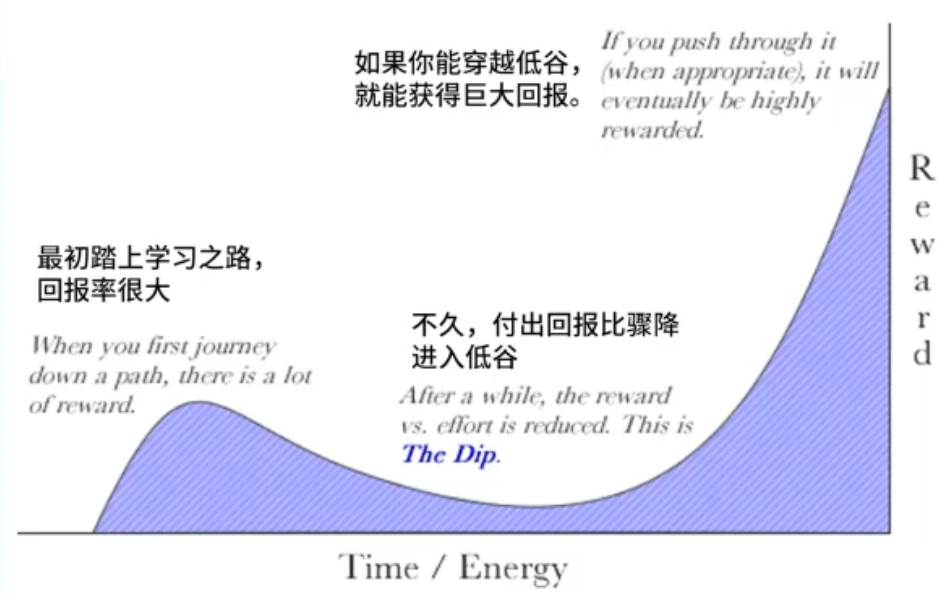
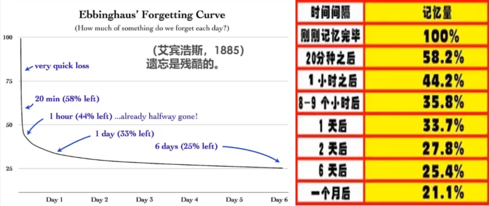
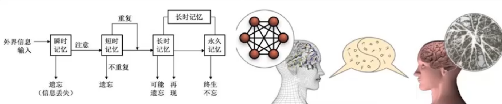
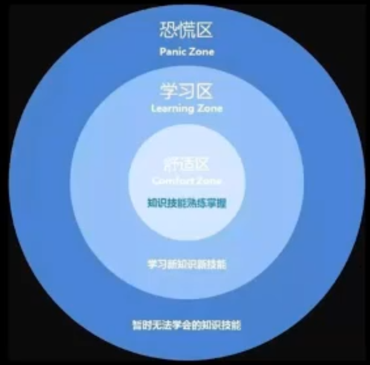
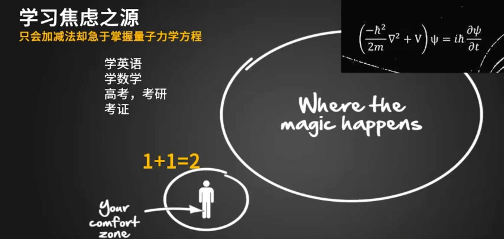
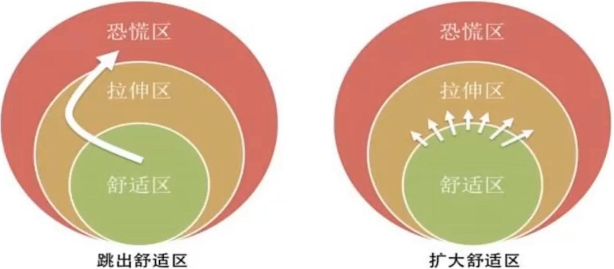
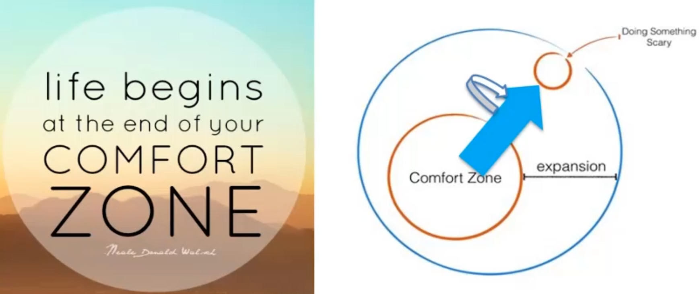
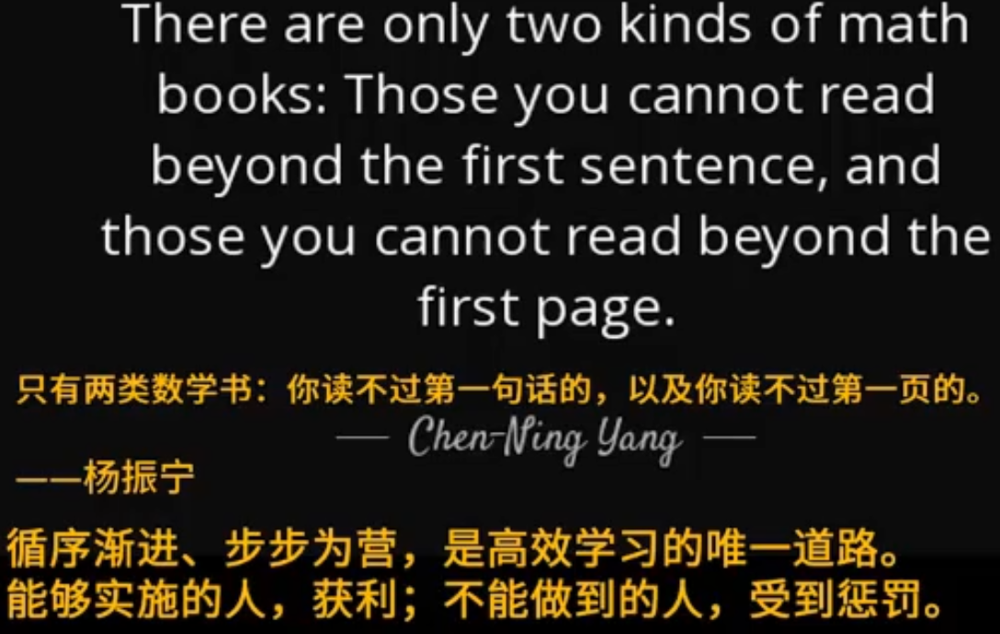
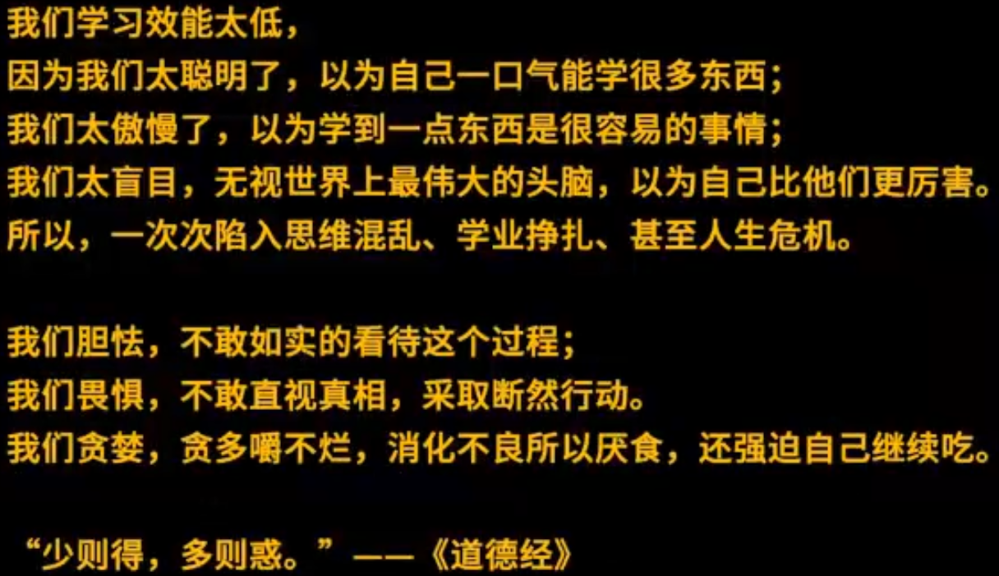
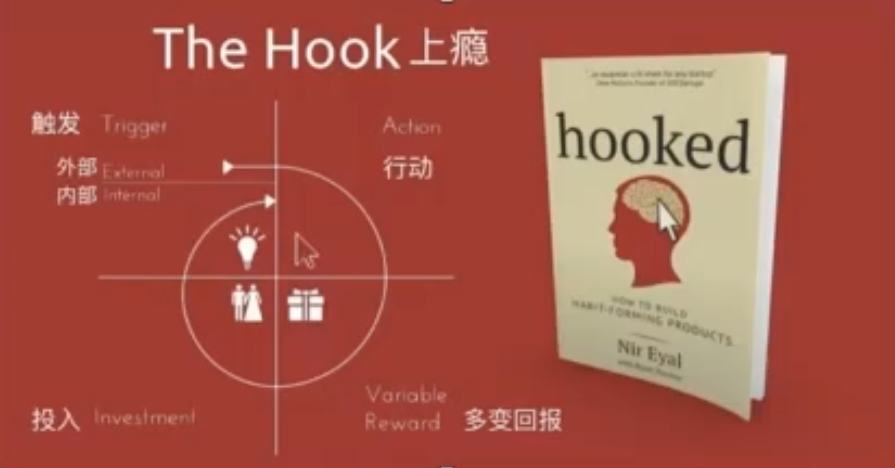

# 快速突破学习低谷

## 1. 参考书目：

低谷  the dip - seth.godin

## 2. 学习低谷的三个阶段

1. 接触一个新东西，回报率很大，一付出就会有收获。
2. 过一段时间后对学习不满意了，原因是付出和回报率降低了
3. 理想阶段，找到问题的结症，真相所在，进入高速增长阶段，达到从来没有到达的高度

## 3. 低谷的产生

是什么让我们陷入低谷的？

人生低谷、学业低谷让人陷入深度焦虑乃至绝望、崩溃、挣扎的边缘

是什么让我们深陷焦虑与绝望？

收获(付出回报率)不如期初那么大了

​	

为什么收获不如起初那么大了？

因为所学的东西，大都已经忘了

​	开始学一个新东西，一天总是觉得新鲜感，能够学到新东西，可是后期的话为什么一天感觉没什么收获？

​	根本原因就是以前学的东西大多数已经忘掉了。

为什么所学的东西已经忘了？

因为没有及时复习

​	很多时候我们弄不清楚，总以为所学的东西忘记了是不是学习方法不对？或者说还有什么学习秘诀？最近状态不佳？等等各种可能性的原因。其实最简单最直接的原因就是没有及时复习，重复的遍数不够。

为什么没有及时复习？

因为要学的东西太多

​	总想往前赶进度，总想飞，结果总是摔跟头。

那你打算怎么办？

... 陷入思维混乱和挣扎...

​	一点点学习，频繁回顾，多复习几遍，听起来是个效率很低的一个办法，就挣扎矛盾了，又想往前跑，又觉得这么做效率是不是低，陷入思维混乱的挣扎了。这样经历多了，屡屡失败，屡屡是因为向前赶进度而造成失败。而且失败会造成焦虑、挣扎，后面习得性无助，造成做我怀疑。

​	痛定思痛后下定决心，必须踏踏实实学习。对于学习而言，这个学习低谷，只有一个原因，看不清自己，没有找到核心的因果关系。

​	比如背单词，考研、托福、gre的单词表，背的最熟的就是abandon，“放弃”这个单词，后面好多人放弃了考研、托福、GRE、6级。“abandon”为什么背的那么熟？因为它是第一个单词，重复的次数够多，所以记得最清楚，其他单词以此类推都这么去搞完了，就都拿下来了，就这么简单。

## 4. 遗忘的机制

​	遗忘背后的科学机制是什么？ 艾宾浩斯遗忘曲线：

它告诉我们遗忘是如何残酷。

​	对于想要追求高效学习的人而言，一个小时之后不用管，要记住20分钟这个数据，初学一个东西，20分钟后只剩下58%，意味着一半的知识已经遗忘了，想要把知识掌握好，20分钟内必须要复习。对于高效学习而言，不是20分钟要复习，而是当回忆起来感觉到模糊时，就要赶紧复习，模糊了就意味着这些东西快要丢了。最终推导出来方法就是：

​	**必须高频回顾，然后才能急速推进。**

## 5. 记忆的机制

 神经科学/神经心理学/认知神经科学 告诉我们：凡是记住任何东西，一定会对应产生相关的神经结构上的变化。包括建立了新的神经回路的连接，包括神经元的轴突树突上长出了新的分支。甚至像出租车司机在大脑里，对应城市地图的脑区，面积比平常人大。所以学习对应着神经生理结构的改变，也就是说：

>  学习不是像长肌肉，学习本身就是长肌肉

这里的肌肉指的是神经系统，所以要改变观念，学习不是掌握一些抽象的知识或者形象的图画或者学个技能这个抽象的东西，不是的，它对应着我们神经结构的改变。学习就是改变生命，是改造生命。所以它这么难，把很多人卡住了。原因就在于学习本质上是在改造生命。

从记忆的神经科学的基础原理来看，记忆的各个阶段都是在改造神经系统，所以很难。

### 5.1瞬时记忆

​	我们看到外界的信息，看到一个画面，注意去观察，就立刻产生了**瞬时记忆**，闭上眼睛就能在脑海中浮现这个画面出来，甚至是一些重点的句子都能浮现出来。这个叫瞬时记忆。如果不去重复它，不去继续保持注意的话，那么这个瞬时记忆就丢掉了，第二天就想不起来了。

### 5.2 短时记忆

​	那么想要把它变成一个长久的记忆怎么办？只能再投入注意，然后再重复。这样的话瞬时记忆就变成了短时记忆了。所谓短时记忆，也就是说重复保持注意，10分钟之后你再回顾这个图像，还能想得起来，这就叫短时记忆。

### 5.3 长时记忆

短时记忆想变成长时记忆，想要几个小时之内还记得，就需要重复，抄写一遍，做笔记都是属于重复。那么他就可能变成长时记忆。

### 5.4 永久记忆

永久性记忆，一辈子忘不了，。把瞬时记忆、短时记忆、长时记忆、到终身记忆的过程抄写到笔记上，然后再去默写，这样的话可能变成永久性记忆。

## 6. 刻意练习

刻意练习是讲世界各个领域的顶级专家是怎么练就的一套理论。其中有个关键的学习心理模型：

### 6.1 学习心理模型

我们学习任何知识，都可能处于三种心理状态：

1. 舒适区

   觉得很简单，不构成任何挑战，就是学习处于舒适区中

2. 学习区

   学习的难度增加了，但是努力的话，还能掌握。

3. 恐慌区

   学习的挑战性太大，都不敢去面对所学的内容。

学习效能的高地取决于在你处于哪个区？在进行怎么的移动？在进行什么样的动作？

### 6.2 学习焦虑

刚刚掌握1+1=2这样的基础知识就去想弄明白量子力学，薛定谔方程。就只能一次次失望，一次次绝望。因为中间差的太多了，还差数学物理方程，前面还有微分方程、高等代数、线性代数... 所以没办法搞懂。焦虑都是这样来的。从简单的很熟悉东西，想一步跨得很远，于是焦虑就产生了。学英语、数学、考研、考证...焦虑都是来自于这个。想飞想跳，但老是摔跤。

千百种的悲剧都是来源于从舒适区直接跳到恐慌区里面去了。从很简单的内容一下子跳到很陌生的领域去了。然后就恐慌，焦虑。错综复杂的心理状态就产生了。

高效能的学习正好相反，高效能学习唯一的办法就是：逐渐的去拉伸这个舒适区，在舒适区和学习区交界的那个地方，投入大量的时间，80%~90%的时间都在这里。

费曼的话也是符合这个原理，你学到哪里，哪里卡住了，你再从头回顾。 在那里卡住了就意味已经处于学习区和恐慌区的边缘了，不要再往前走了，再往前走的话你会开始挫败了。开始焦虑了，开始无助了。不要再往前走，要返回来。回到哪里呢？回到舒适区里。从一本书的开始，那肯定是你比较熟悉的，但是要加深熟悉的程度，重复的过程中就会发现之前有一些盲点，有些错漏的模糊点。甚至是错误理解的点被抓住了。这个就是学习区里面的东西了，把它弄明白了之后就会发现员原来卡住你的东西卡不住你了。就可以往前推进了。这是高效学习的唯一的道路。它不跳，它是循序渐进的推进。

现在很多人讲高效学习要跳出舒适区，可是问题就出在“跳”字，有些人抓住了事情的一面，但是忽略了事情的另一面，同样有问题。一面是不求上进，总在自己熟悉的地方呆着，不忘外面走，不去扩大自己的能力圈，能力范围，这个是不对的，可是主张跳出舒适区，就往下栽了。

杨正宁学习数学也一样觉得很难，也必须要循序渐进，步步为营。

费米的思想：

**抽象化应该在具体的基础工作之后，而绝非在它之前**

比如说艾宾浩斯在1895年的心理学研究告诉我们什么？告诉我学习是残酷的，其实知道这句话没有用，知道这句话，完全一字不差的记得它都没有用，有用的是什么？使具体化，要知道艾宾浩斯遗忘曲线的具体数据是什么？我们学一个新东西，即便是当时记住了，20分钟后就只剩下58%了。知道这个具体的数据就知道了学习记忆是如何的残酷，是何等的残酷，而且知道20分钟以内就要重复了。甚至推断出必须高频回顾，高频重复，才能掌握一个知识。那然后就是具象化之后又抽象化。抽象化的学习残酷，这个时候对你来说才有意义。有指导性的意义了。

 很多人受不了“少”，可是一点一滴的少，累计起来就不少了。能积微者速成

### 学习的乐趣

### 具体的操作

暴力突破学习（考试）的核心思维程序

1. 第一章第一节满分（趋近100%）
2. 第一章第二节满分（趋近100%）
3. 综合复习满分（趋近100%）
4. 以此类推

循序渐进=快进=熟练=熟能生巧=上瘾=跃迁

思考题：

1. 最近一次拿到“满分”是什么时候？
2. 有没有哪个细小的环节（章节）是你能够得满分的？
3. 还有哪些细小环节（知识点）是你能够得到满分的？
4. 如何高频体验成功，激活上瘾回路？

