# 快速找到学习捷径

##  1. 学习的核心算法

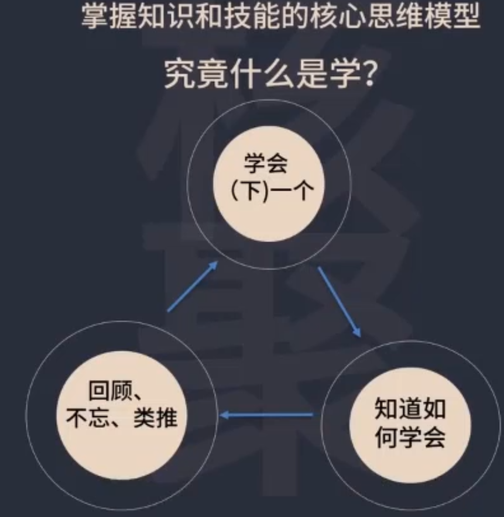

## 2. 学习的本质

学习的本质定义很简单，就是模仿。

冯诺依曼学习英语的案列：

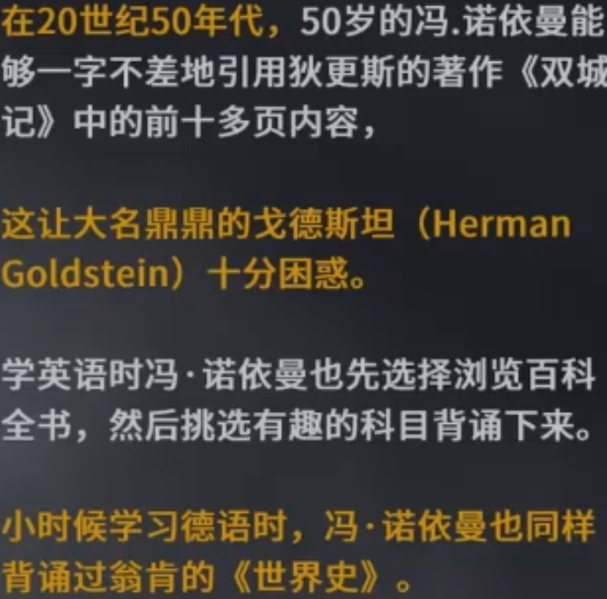

冯诺依曼学习英语的秘诀：

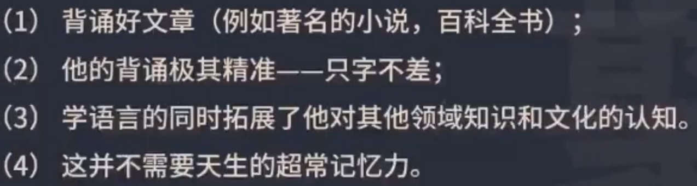

林语堂学习英语：

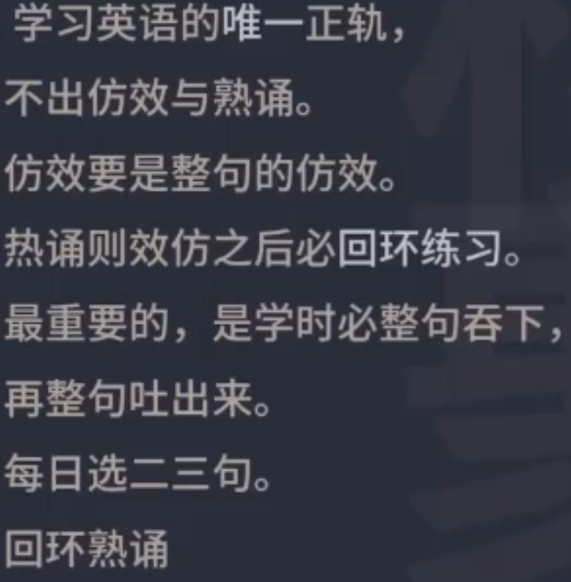

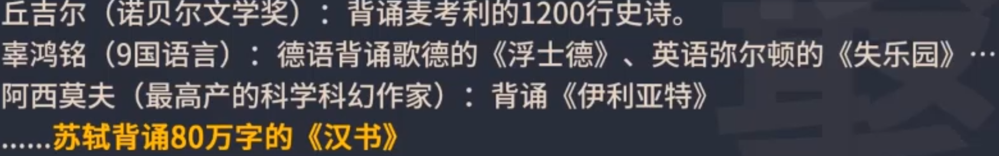

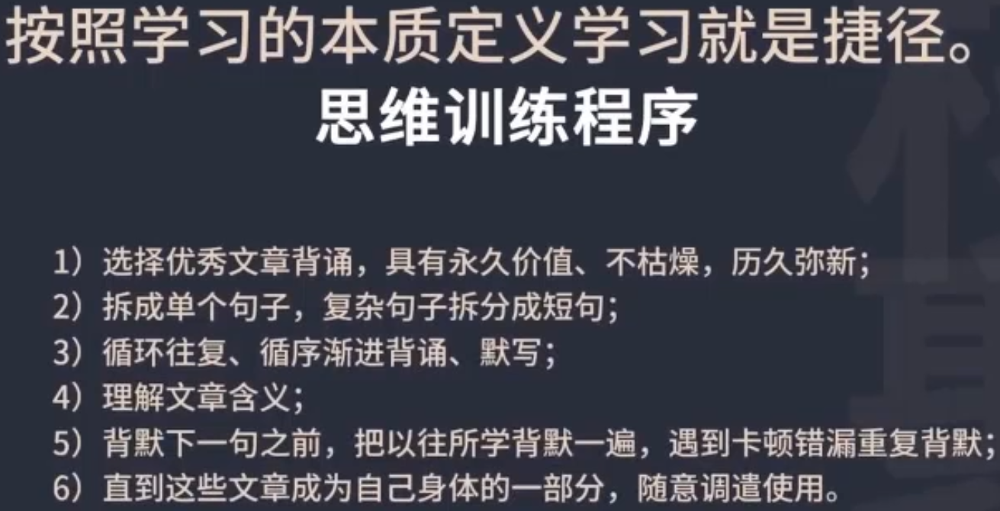

21天突破英语：

背诵23篇英语文章

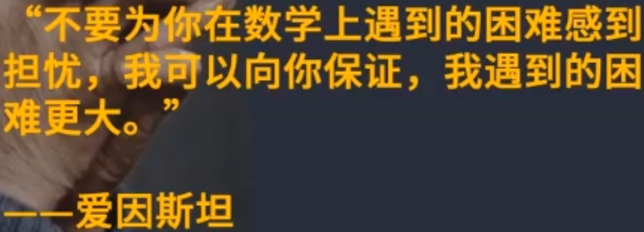

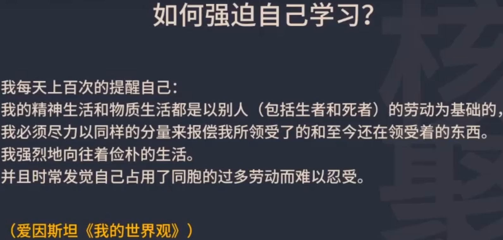

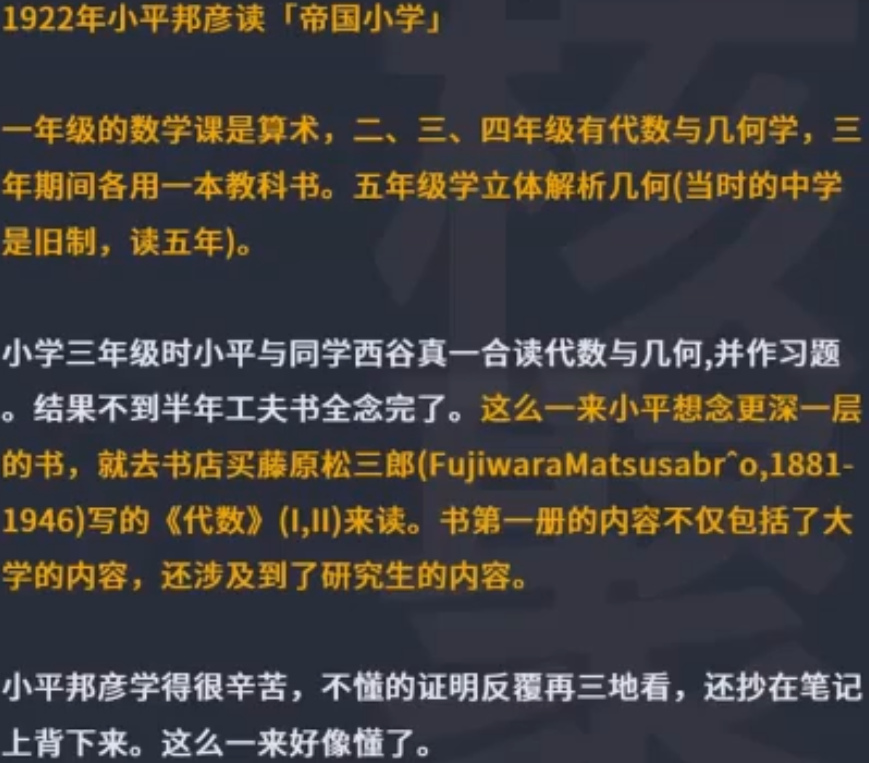

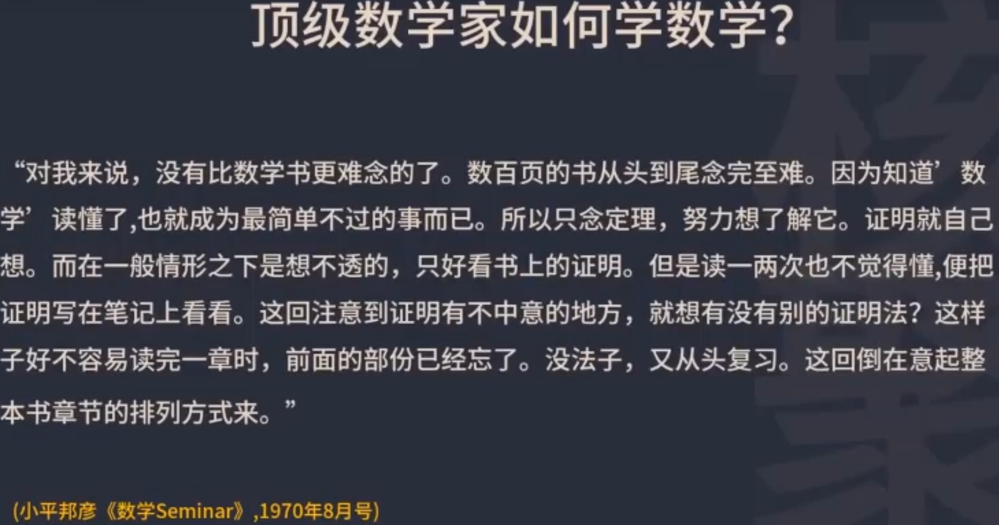

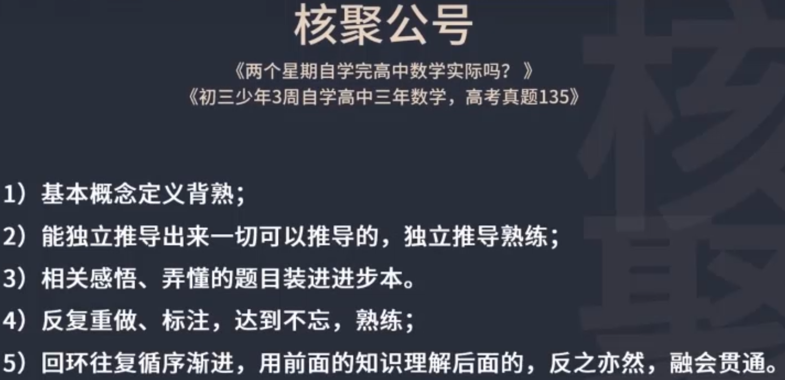

数学短期突破的要点

1. 基本概念，基本定义一定要背熟。

   ​	定义就是定下来才有意义，如果定义搞不清楚，做题目就没有思路。定义如果记得有误，有漏洞，不够完整，结题就会错误，以为有思路，其实做错了。

2. 能够独立推导出来一切可推导的东西。

   ​	一定要独立推导，并且推导的得熟练。教科书上有的定理的证明和推导过程，一定要自己独立推导出来，而且要熟练。因为这些基本定理、基本公式的推导证明过程，就是数学思维的核心。所谓核心，就是在做所有数学题的时候，会反反复复，一而再，再而三地运用这些方式。数学最核心的思维就是蕴含在定理公式的推导证明里，所以必须拿下来，拿下来就意味着可能会达到一通百通的状态。你不知道是第几个证明，你熟练之后会突然豁然开朗，觉得数学原来如此简单，就是几套思路反反复复使用，效率大大提升。

3. 当去抄写背诵默写定义概念，去尝试理解，尝试推导定理公式的时候，会有很多感悟，很多感想，一定要把这些感悟就下来，这个是非常宝贵的。

   ​	付出努力的一个非常重要的收获就是这个过程中的感悟。发现数学是怎么回事，数学思维是怎么回事，记下来。弄懂的题目要装进进步本里，不会做的后来会做了，做错了后来弄着正确了，要放到进步本里面去。放到自己的笔记本里面去，反复去复习。因为做错了，意味着之前的认知一定是有错的地方，要把他补上来，还有不会的做的题目弄懂了，为什么弄懂了？一定是之前的概定义，要不然忘掉了，要不然理解错了，现在能把它纠正过来，要把它记录下来，必须记。因为记下来，巩固住，以后就不会犯这种错误了。大大节省时间和精力，这个是高效学习的必经之路。一次错误抓住后，以后可以避免成百上千次犯这种错误。

4. 要反复重做标注，达到不忘，达到熟练。

   ​	就是回环练习，有些错误以为改过来了，下次还是会犯同样的错误，以为一个题目会做了，重做的时候发现又卡住了。所以要去重做，要去做标注。把卡住的地方，弄错的地方不断做标注强化它。达到不忘、熟练。

5. 回环往复，循序渐进

   ​	用前面的知识理解后面的知识，反之用后面的知识理解前面的。达到融会贯通。

数学和英语的学习方法都是一样的，模仿和可以练习，就是最高效的学习方法。按照学习的本意去做，就是捷径，它对一切学问，一切知识，一切技能都是同样的。

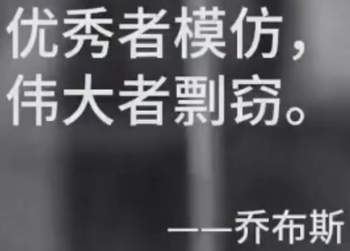

触摸屏不是苹果发明，鼠标不是苹果发明的，但是这些东西很好，就可以拿来为我所用，创业也是一样的法则，所有领域的牛人，全都是来自模仿。

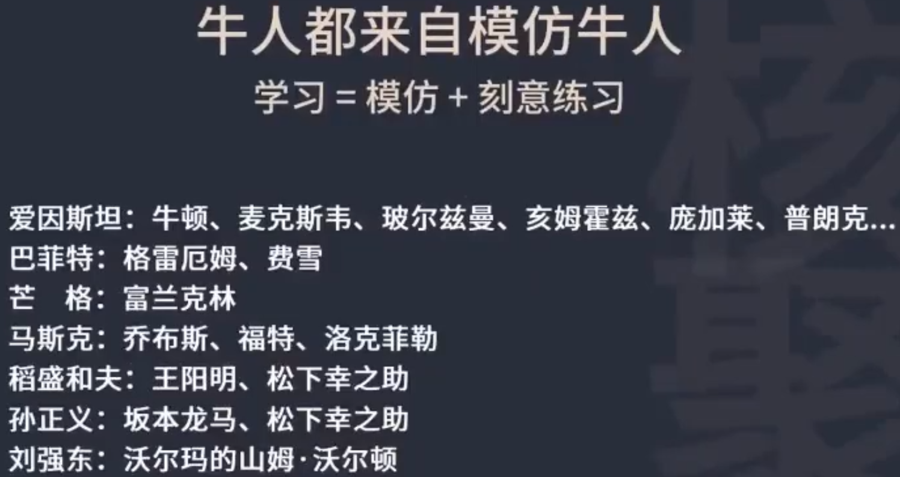

## 思考：

你最成功的模仿经历是什么？

