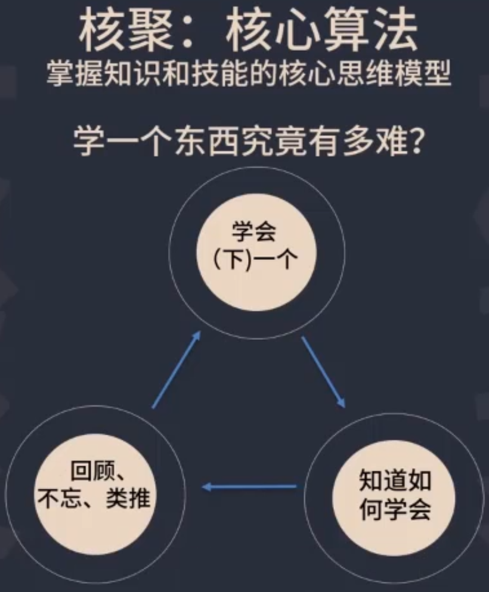
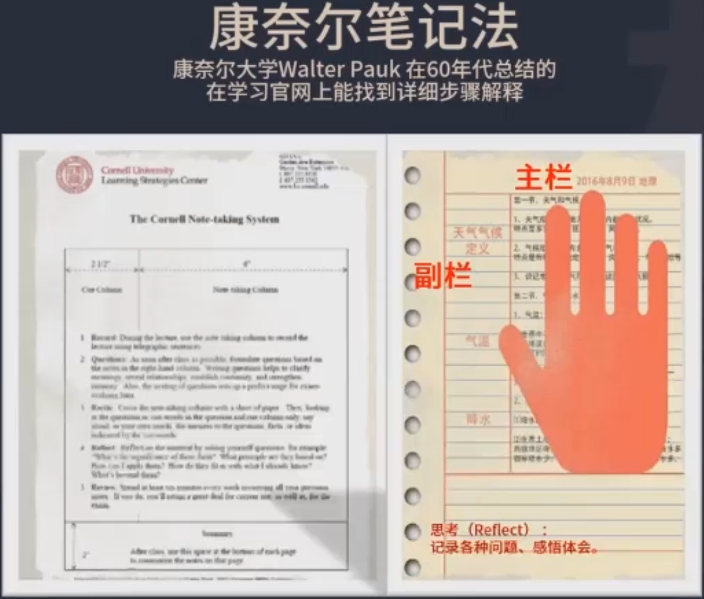
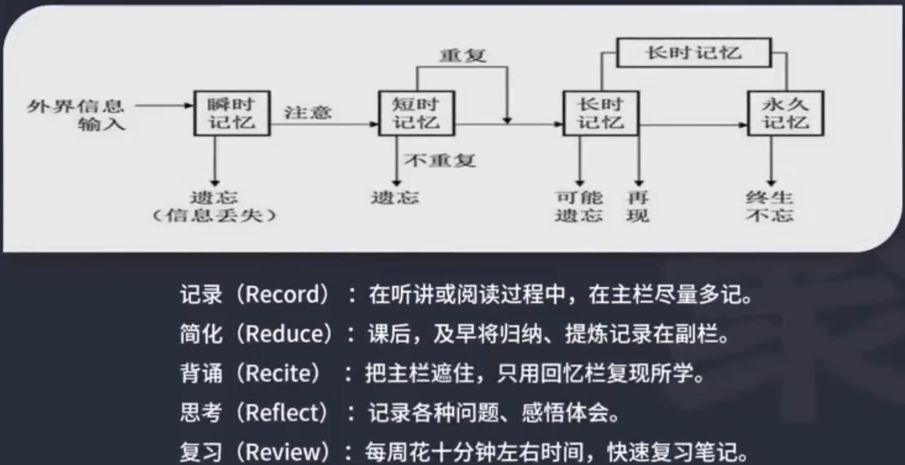
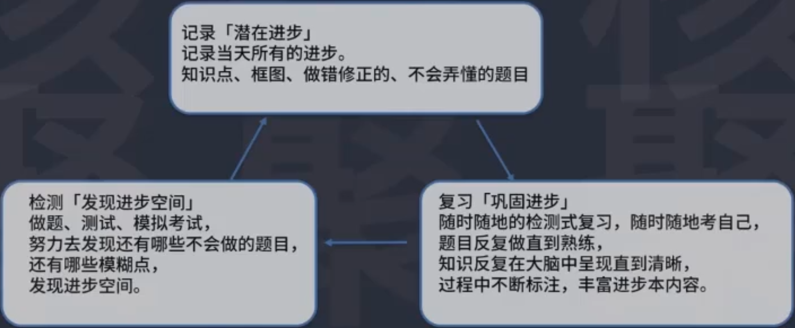
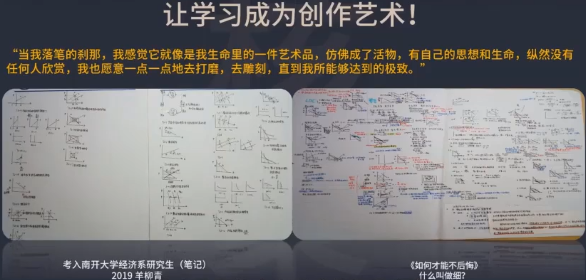
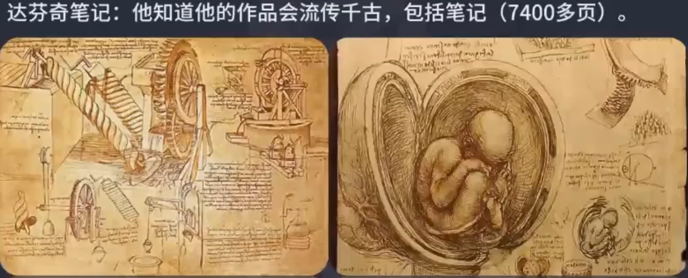
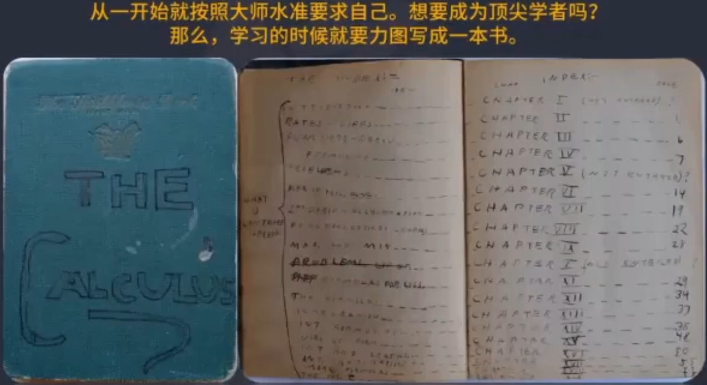
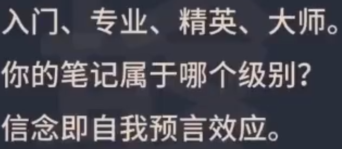

# 建立专家水准

建立专家水准，让学习成为一种习惯，达到一出手就是专家水平。

关键是学会一个知识究竟有多难？

## ## 1. 康奈尔笔记法

康奈尔大学教授发明的方法。怎么做笔记呢？一页笔记分为三个部分：

1. 主栏

   主题内容，大部分内容就在右边右上角。读书听课时，记下尽可能多的丰富的信息，就是记录这个环节。

2. 副栏

   课听完了后，要尽可能简洁抽象，抽象，归纳。概括学习到的内容。完成后再把主栏遮住，根据抽象归纳出来的这几行字，几个概念能够复现出所学习的主体内容，也就是主栏的内容。

3. 思考栏

   思考，究竟学到了什么？把想法感悟，体会等，还有没有解决的问题，写到思考栏。

康纳尔学习法：

必须要随时随地复习，要检测式复习，自己考自己，当哪儿回忆起来模糊了，就要回去重复，标注，默写。做会了不够，考试是计时的，必须要熟练，要高度熟练。题目反复做，做到熟练，知识在大脑里反复呈现。达到清晰的标准。这个过程要丰富进步本的过程。加强知识之间的连接。同时加深神经回路。

感觉笔记的内容都掌握了，还不够真实，还要做检验。通过做题目，模拟题发现还有没有什么漏洞。

考试分为资格考试和竞争性考试，资格考试比如驾照，司法考试，竞争性考试比如高考、考研，录取率固定，择优录取，就需要学习到极端。极高的分数才能入选。

学习的过程中需要不断地发现还有哪些盲点，哪些模糊点，把它抓出来。弄清楚了，弄熟练了。分数就上去了，不断趋近于满分。所以要做题，要测试，一方面是巩固，融会贯通之前所学的知识。另一方面就是发现进步空间。有时候就是很小的一个点，一个错漏，也要把它抓住，那就是分数，能力，水平。而且越高水平的人，对细节的关注就越多。

记录、复习、检测三个环节首位相贯，就高速运转起来了。

有人使用进步本的方式是错误的，错题改正后直接把答案写在上面，这个就不对，违背了进步本的精神。把题目放上去是方便后面自己考自己的，把答案贴上去就无法考自己了。

正确的做法是：把题目记录下来，各个选项记录清晰，配图，每个选项的分析，正确答案写在很后面，就很利于自己考自己了。下面部分挡住就可以重新考自己了。对于题目的笔记，

1. 题目和答案一定要分离。
2. 分析所有选项的正误。知道哪个是正确的，错误的也要去分析为什么是错误的。
3. 还要分析出题人的意图。

笔记示例：

费曼中学的笔记，现存于加州理工学院

笔记上话：

> 推导出欧拉公式，成为欧拉

笔记的最后是目录，按照写书的方式做笔记。笔记完成后就是一本书。

从学习的一开始，就按照大师的水准要求自己。

无论什么领域，想要成为顶级的专家，当学习的时候，就要力图写成一本书。

费曼的导师，惠勒：

> 你想成为任何领域的专家吗？写一本那个领域的书，这就是方法。

任何领域的人的水平分成四个等级：

为什么一开始就要按照顶级的水平去做？因为信念即自我实现预言，这么想这么去做，这么实现的可能性就大。从一开始笔记都是乱七八糟的，就不要想成为那个领域的专家了。

如果想成为哪个领域的顶尖高手，想要短期内突破哪个领域的知识和技能， 从一开始，一点一滴就要按照最高水平要求自己。

