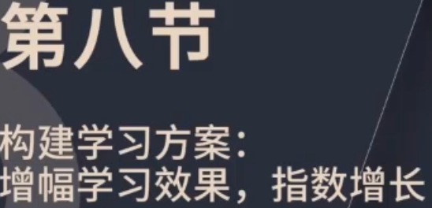
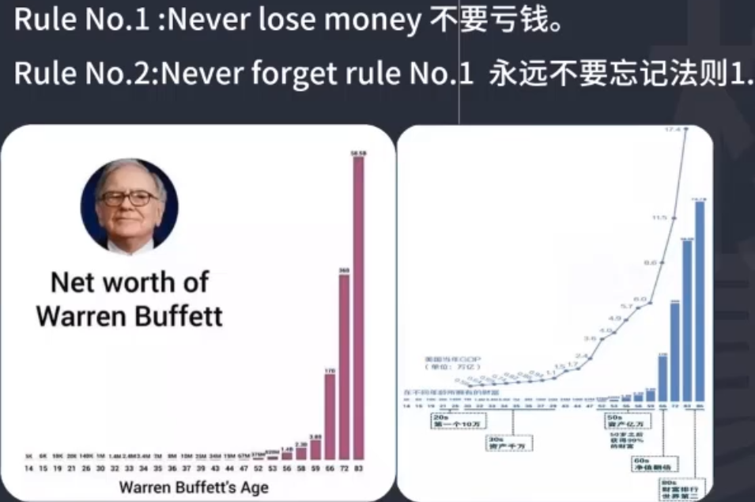
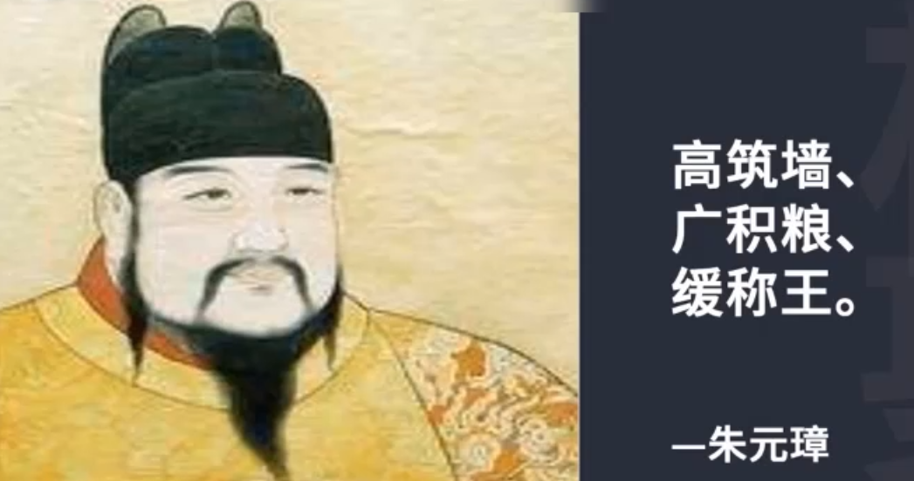
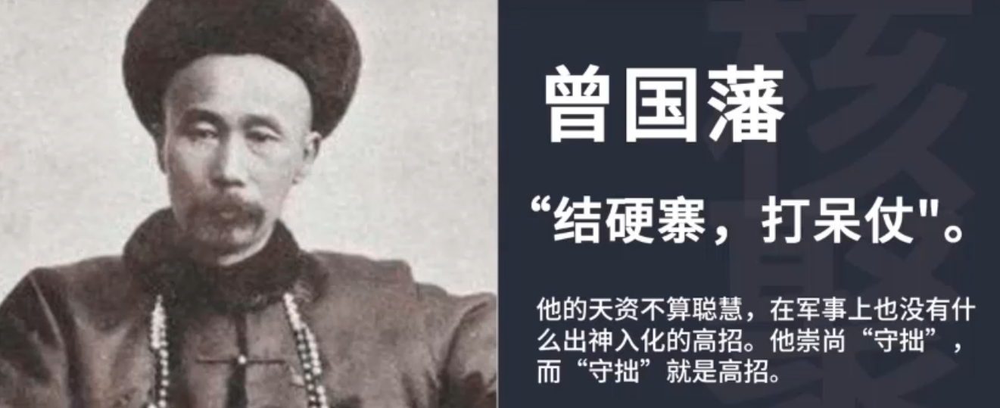
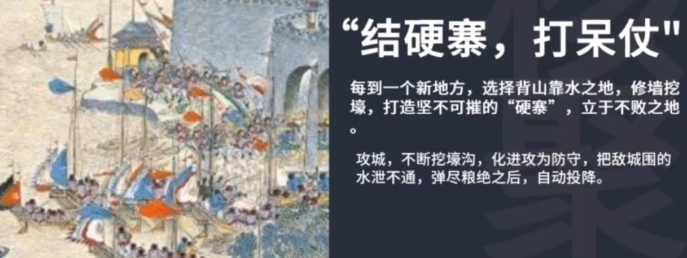
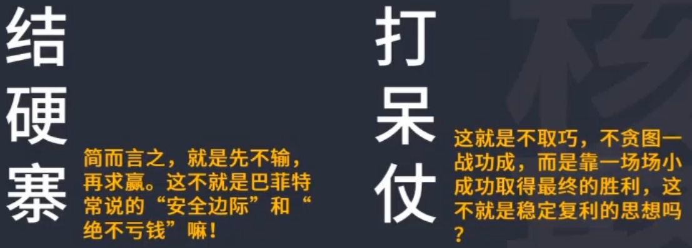
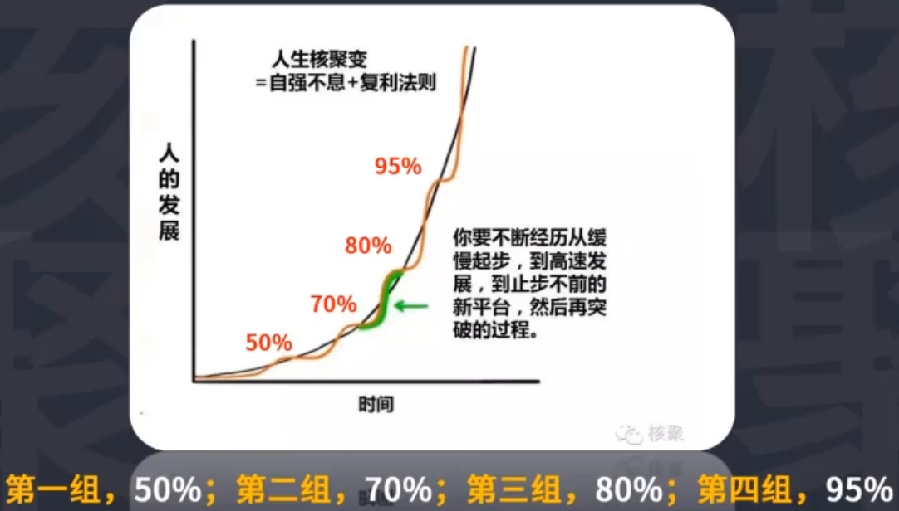
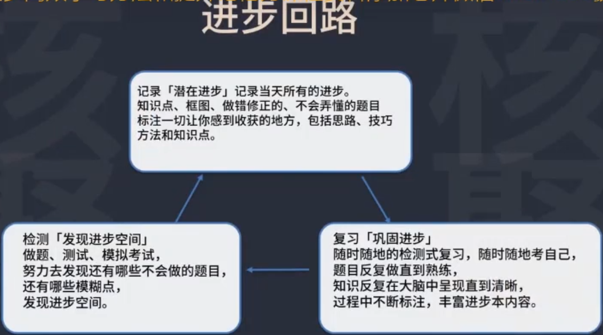
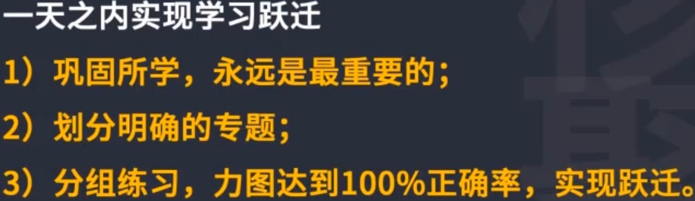

# 学习方案

方案：要能显著的解决问题，极其缜密，严谨。

巴菲特的财富指数增长

学习方案第一条法则：不要遗忘学到的知识

学习方案第二条法则：不要忘记第一条

学到的知识不要遗忘，要反反复复不断去的复习，确保已经学到东西抓住了，百分之百掌握了，然后再图进步。

学习法则，赚钱法则，人生法则，战争法则

这个法则用在学习上：

案例：给文科生提升数学成绩，

选择花些力气就能见效果的章节，把题目分成5组或者6组，每组5题或者6题。每组都用进步本的方法，开始的时候一组6题可能只对了3题，详细的把题目整理下来，到底从这道题里学到了什么，错在哪儿了？哪有漏洞？哪个思路没掌握，哪个技巧没掌握？原原本本，老老实实记录在进步本里。记录的过程就是熟练的过程，加深记忆，加深理解的过程。错题梳理完后再重做一遍，就是记录本的复习和巩固环节。看答案或者听讲解明白了和独立的重做能不能做出来是两回事。要必须确认，确实能够独立做出来。然后再进行下一组的联系。

投资法则：

Rule#1: never lose money.

Ruler#2: never forgot rule#1.

法则1：永远不要亏钱

法则2：永远不要忘记第一条

学习法则：

Rule#1: never lose knowledge.

Rule#2: never forgot rule#1.

法则1：永远不要遗忘知识,，巩固他，回环巩固。

法则2：永远不要忘记第一条

结硬寨打呆仗

划分明确的专题

​	究竟要提高什么先搞清楚

分组练习

​	目标是达到100%的正确率，这个过程中学到的任何点滴都要记录下来。熟练化，一步步接近100%正确率

经过这个训练，正确率会上升，实现跃迁，一方面是实际效果上的，一方面是心理上的。对知识的把我，记忆，和透彻的理解，还有信心的跃迁。

## 思考

1. 如何实现可持续的跃迁？
2. 如何体验到熟练掌握知识的感觉？

