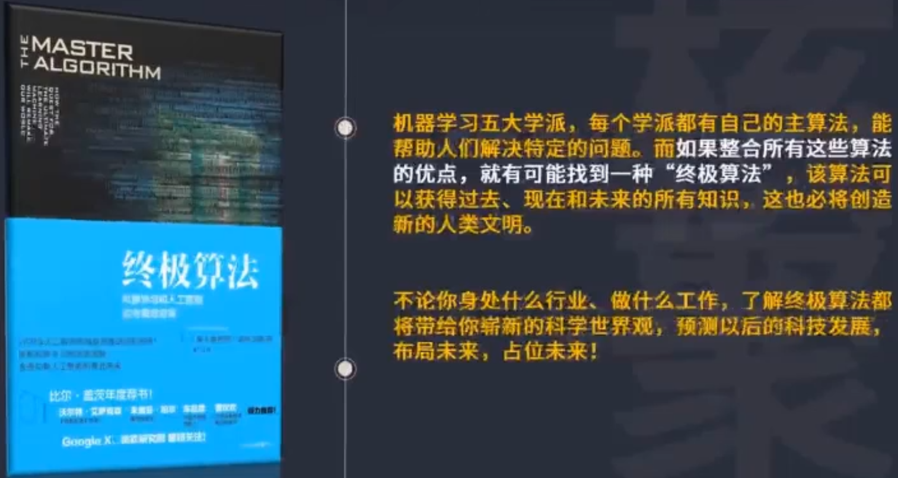
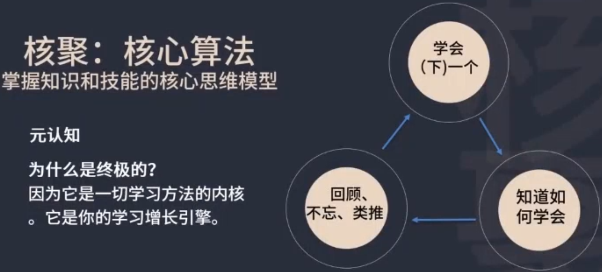
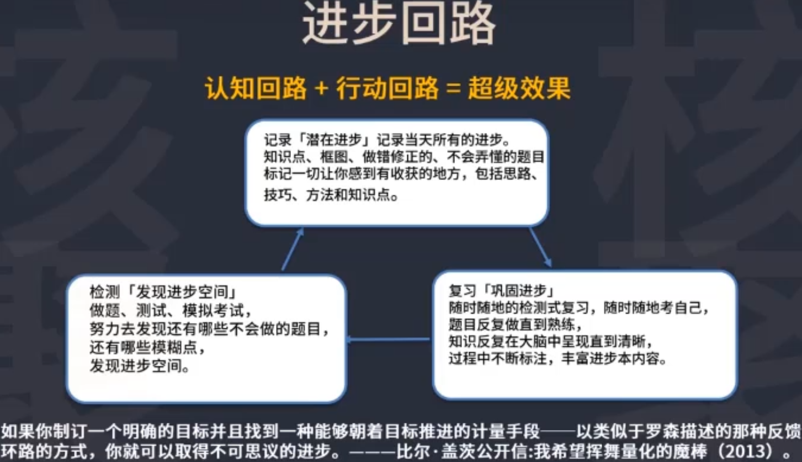
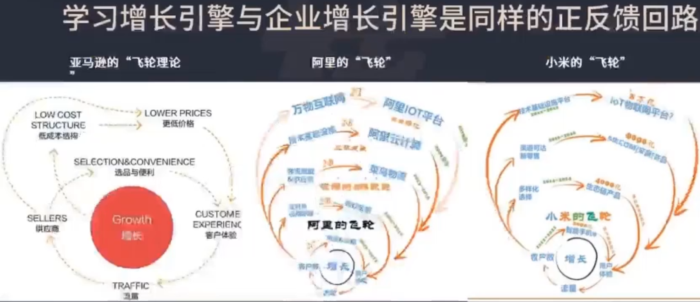

# 学习算法

学习机器：

考试的价值：

考试是衡量知识掌握程度的非常好的工具。如果有好几种方案可以选择，考试可以量化的给与反馈。给改进学习方法，选择学习方法提供了标准。自己做学习实验，检测出来。

为什么对进步本的方式这么有细心，是因为直观的效果表明它是一个高速进步的方法。而且检测的时间并不长。

如果学习回路闭环了，从怎么操作，怎么去认识，到产生效果，能够封闭起来，一个环节促进另外一个环节，旋转起来，那么考试的心态就会很好。

高中阶段每周每月有个综合性的考试，能够反馈准确的分数和排名，在人生中的其他阶段没有这样的机会了，大学、研究生、工作阶段都没有了。每周都提供一个精准的反馈，需要一个大型的系统支撑。

在 大学、研究生、工作阶段，就需要自己设置这样的回路去训练自己。

正反馈回路，增长引擎，增长飞轮，从认知到实践上掌握住，学习、职场、创业都可适用。

## 思考

1. 你的学习的增长引擎是什么？
2. 你的人生的增长引擎是什么？

