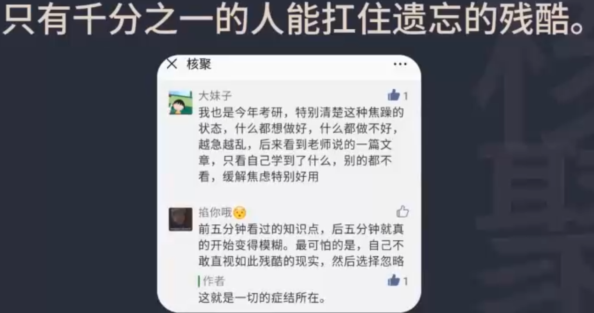
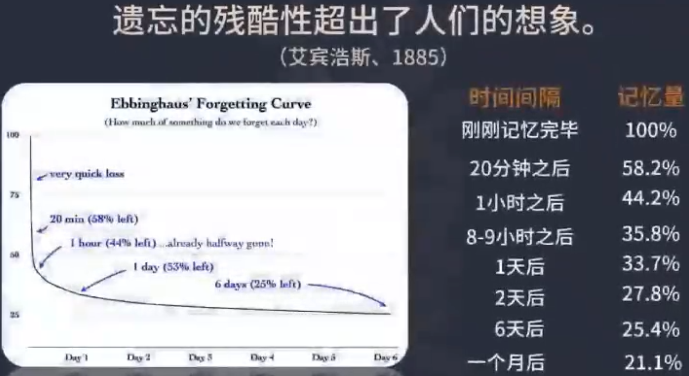
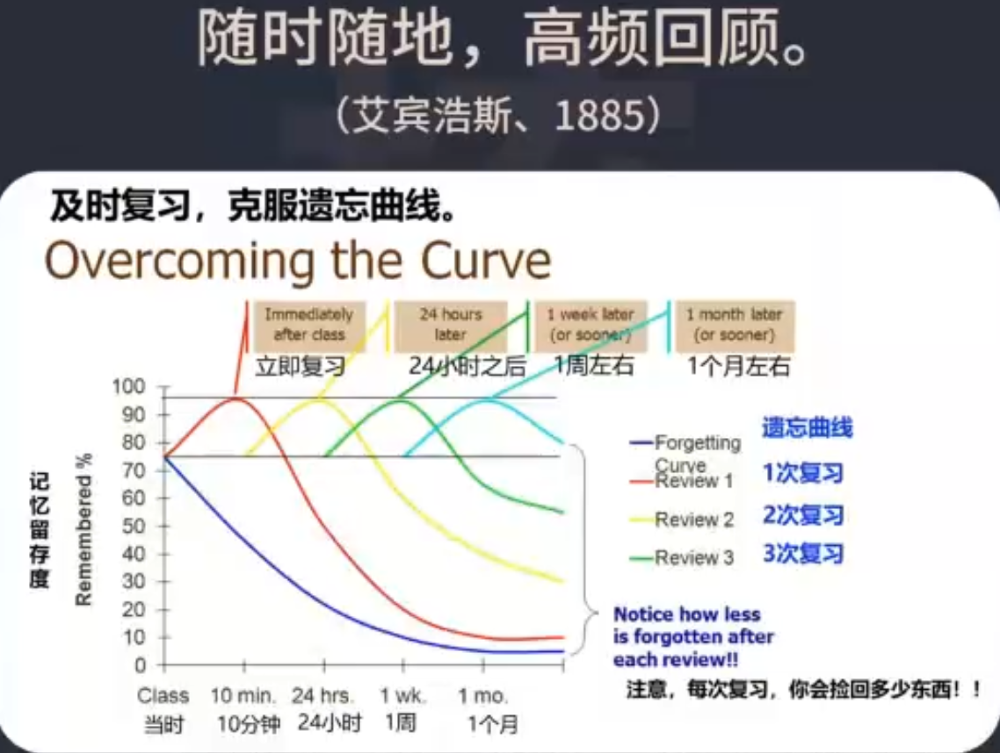
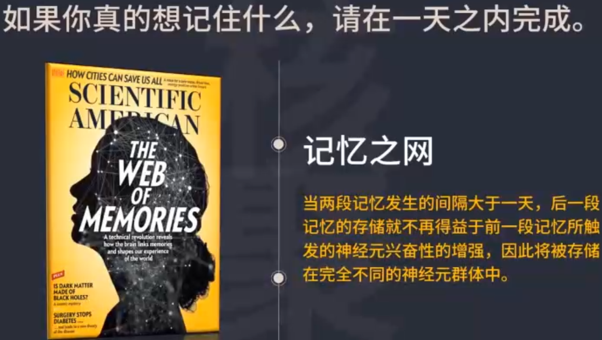
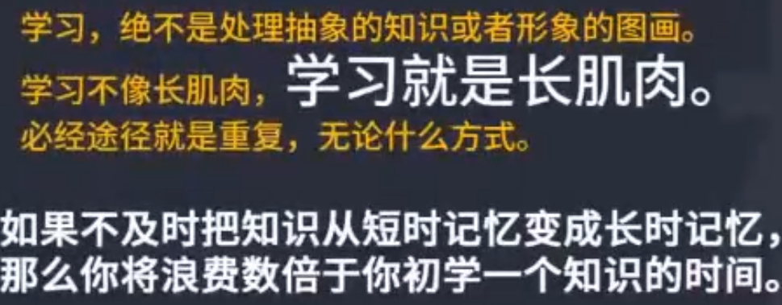
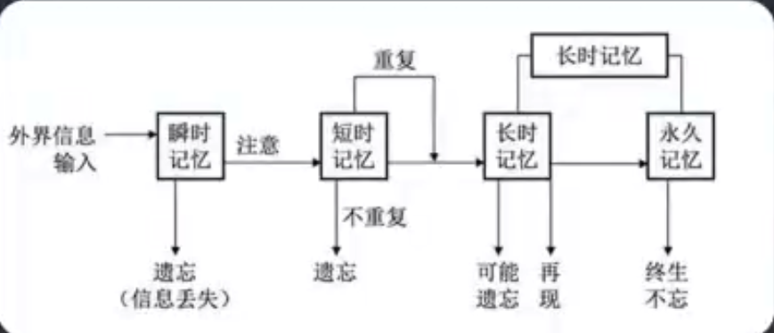
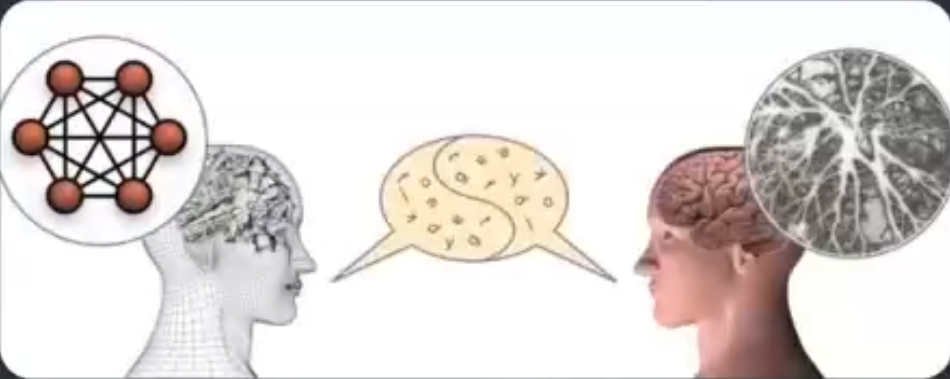

# 超级记忆法

1. 记忆困难的根本原因是什么？

2. 如何记住一堂课的内容？

​		

真正有用的知识是细节，但是很多人学习的是模糊的概念，不能为我所用。

如果不及时把知识从短时记忆变成长时记忆，那么你将让费数倍于学到这个知识应该用的时间。

学习最麻烦的、最终极的障碍就是贪婪。

思考题：

1. 你有没有测试过自己的遗忘速度？
2. 你用过什么方法有效巩固过自己的记忆？

